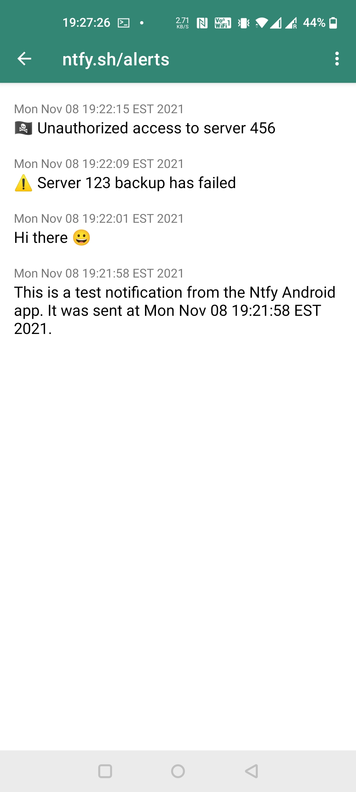

# ntfy.sh | Send push notifications to your phone or desktop via PUT/POST

**ntfy** (pronounce: *notify*) is a simple HTTP-based [pub-sub](https://en.wikipedia.org/wiki/Publish%E2%80%93subscribe_pattern) notification service.
It allows you to **send notifications to your phone or desktop via scripts** from any computer, entirely **without signup or cost**.
It's also open source (as you can plainly see) if you want to run your own.

I run a free version of it at **[ntfy.sh](https://ntfy.sh)**, and there's an [open source](https://github.com/binwiederhier/ntfy-android) [Android app](https://play.google.com/store/apps/details?id=io.heckel.ntfy)
too.

  
  
  
  
  

## **[Documentation](https://ntfy.sh/docs/)**

[Getting started](https://ntfy.sh/docs/) |
[Android/iOS](https://ntfy.sh/docs/subscribe/phone/) |
[API](https://ntfy.sh/docs/publish/) |
[Install / Self-hosting](https://ntfy.sh/docs/install/) |
[Building](https://ntfy.sh/docs/develop/)

## Contributing
I welcome any and all contributions. Just create a PR or an issue.

## Contact me
You can directly contact me **[on Discord](https://discord.gg/cT7ECsZj9w)**, or via the [GitHub issues](https://github.com/binwiederhier/ntfy/issues),
or find more contact information [on my website](https://heckel.io/about).

## License
Made with ❤️ by [Philipp C. Heckel](https://heckel.io).   
The project is dual licensed under the [Apache License 2.0](LICENSE) and the [GPLv2 License](LICENSE.GPLv2).

Third party libraries and resources:
* [github.com/urfave/cli/v2](https://github.com/urfave/cli/v2) (MIT) is used to drive the CLI
* [Mixkit sound](https://mixkit.co/free-sound-effects/notification/) (Mixkit Free License) used as notification sound
* [Lato Font](https://www.latofonts.com/) (OFL) is used as a font in the Web UI
* [GoReleaser](https://goreleaser.com/) (MIT) is used to create releases
* [go-smtp](https://github.com/emersion/go-smtp) (MIT) is used to receive e-mails
* [stretchr/testify](https://github.com/stretchr/testify) (MIT) is used for unit and integration tests
* [github.com/mattn/go-sqlite3](https://github.com/mattn/go-sqlite3) (MIT) is used to provide the persistent message cache
* [Firebase Admin SDK](https://github.com/firebase/firebase-admin-go) (Apache 2.0) is used to send FCM messages
* [github/gemoji](https://github.com/github/gemoji) (MIT) is used for emoji support (specifically the [emoji.json](https://raw.githubusercontent.com/github/gemoji/master/db/emoji.json) file)
* [Lightbox with vanilla JS](https://yossiabramov.com/blog/vanilla-js-lightbox) 
* [Statically linking go-sqlite3](https://www.arp242.net/static-go.html)
