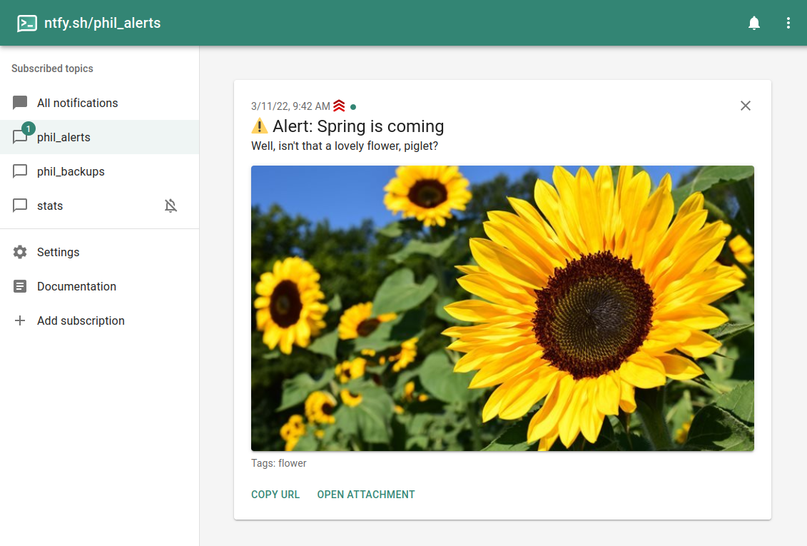

# ntfy.sh | Send push notifications to your phone or desktop via PUT/POST

**ntfy** (pronounce: *notify*) is a simple HTTP-based [pub-sub](https://en.wikipedia.org/wiki/Publish%E2%80%93subscribe_pattern) notification service.
It allows you to **send notifications to your phone or desktop via scripts** from any computer, entirely **without signup or cost**.
It's also open source (as you can plainly see) if you want to run your own.

I run a free version of it at **[ntfy.sh](https://ntfy.sh)**. There's also an [open source Android app](https://github.com/binwiederhier/ntfy-android) (see [Google Play](https://play.google.com/store/apps/details?id=io.heckel.ntfy) or [F-Droid](https://f-droid.org/en/packages/io.heckel.ntfy/)), and an [open source iOS app](https://github.com/binwiederhier/ntfy-ios) (see [App Store](https://apps.apple.com/us/app/ntfy/id1625396347)).

  
  
  
  
  

## **[Documentation](https://ntfy.sh/docs/)**

[Getting started](https://ntfy.sh/docs/) |
[Android/iOS](https://ntfy.sh/docs/subscribe/phone/) |
[API](https://ntfy.sh/docs/publish/) |
[Install / Self-hosting](https://ntfy.sh/docs/install/) |
[Building](https://ntfy.sh/docs/develop/)

## Chat / forum
There are a few ways to get in touch with me and/or the rest of the community. Feel free to use any of these methods. Whatever
works best for you:

* [Discord server](https://discord.gg/cT7ECsZj9w) - direct chat with the community
* [Matrix room #ntfy](https://matrix.to/#/#ntfy:matrix.org) (+ [Matrix space](https://matrix.to/#/#ntfy-space:matrix.org)) - same chat, bridged from Discord
* [Reddit r/ntfy](https://www.reddit.com/r/ntfy/) - asynchronous forum (_new as of October 2022_)
* [GitHub issues](https://github.com/binwiederhier/ntfy/issues) - questions, features, bugs
* [Email](https://heckel.io/about) - reach me directly (_I usually prefer the other methods_)

## Announcements / beta testers
For announcements of new releases and cutting-edge beta versions, please subscribe to the [ntfy.sh/announcements](https://ntfy.sh/announcements) 
topic. If you'd like to test the iOS app, join [TestFlight](https://testflight.apple.com/join/P1fFnAm9). For Android betas,
join Discord/Matrix (I'll eventually make a testing channel in Google Play).

## Contributing
I welcome any and all contributions. Just create a PR or an issue. For larger features/ideas, please reach out
on Discord/Matrix first to see if I'd accept them. To contribute code, check out the [build instructions](https://ntfy.sh/docs/develop/) 
for the server and the Android app. Or, if you'd like to help translate 🇩🇪 🇺🇸 🇧🇬, you can start immediately in
[Hosted Weblate](https://hosted.weblate.org/projects/ntfy/).

## Sponsors
I have just very recently started accepting donations via [GitHub Sponsors](https://github.com/sponsors/binwiederhier). 
I would be humbled if you helped me carry the server and developer account costs. Even small donations are very much 
appreciated. A big fat **Thank You** to the folks already sponsoring ntfy:

I'd also like to thank JetBrains for providing their awesome [IntelliJ IDEA](https://www.jetbrains.com/idea/) to me for free,
and [DigitalOcean](https://www.digitalocean.com/) for supporting the project with $60/yr:

## Code of Conduct
We as members, contributors, and leaders pledge to make participation in our community a harassment-free experience for everyone, regardless of age, body size, visible or invisible disability, ethnicity, sex characteristics, gender identity and expression, level of experience, education, socio-economic status, nationality, personal appearance, race, caste, color, religion, or sexual identity and orientation.

**We pledge to act and interact in ways that contribute to an open, welcoming, diverse, inclusive, and healthy community.**

_Please be sure to read the complete [Code of Conduct](CODE_OF_CONDUCT.md)._    

## License
Made with ❤️ by [Philipp C. Heckel](https://heckel.io).   
The project is dual licensed under the [Apache License 2.0](LICENSE) and the [GPLv2 License](LICENSE.GPLv2).

Third party libraries and resources:
* [github.com/urfave/cli](https://github.com/urfave/cli) (MIT) is used to drive the CLI
* [Mixkit sounds](https://mixkit.co/free-sound-effects/notification/) (Mixkit Free License) are used as notification sounds
* [Sounds from notificationsounds.com](https://notificationsounds.com) (Creative Commons Attribution) are used as notification sounds
* [Roboto Font](https://fonts.google.com/specimen/Roboto) (Apache 2.0) is used as a font in everything web
* [React](https://reactjs.org/) (MIT) is used for the web app
* [Material UI components](https://mui.com/) (MIT) are used in the web app
* [MUI dashboard template](https://github.com/mui/material-ui/tree/master/docs/data/material/getting-started/templates/dashboard) (MIT) was used as a basis for the web app
* [Dexie.js](https://github.com/dexie/Dexie.js) (Apache 2.0) is used for web app persistence in IndexedDB
* [GoReleaser](https://goreleaser.com/) (MIT) is used to create releases
* [go-smtp](https://github.com/emersion/go-smtp) (MIT) is used to receive e-mails
* [stretchr/testify](https://github.com/stretchr/testify) (MIT) is used for unit and integration tests
* [github.com/mattn/go-sqlite3](https://github.com/mattn/go-sqlite3) (MIT) is used to provide the persistent message cache
* [Firebase Admin SDK](https://github.com/firebase/firebase-admin-go) (Apache 2.0) is used to send FCM messages
* [github/gemoji](https://github.com/github/gemoji) (MIT) is used for emoji support (specifically the [emoji.json](https://raw.githubusercontent.com/github/gemoji/master/db/emoji.json) file)
* [Lightbox with vanilla JS](https://yossiabramov.com/blog/vanilla-js-lightbox) as a lightbox on the landing page 
* [HTTP middleware for gzip compression](https://gist.github.com/CJEnright/bc2d8b8dc0c1389a9feeddb110f822d7) (MIT) is used for serving static files
* [Regex for auto-linking](https://github.com/bryanwoods/autolink-js) (MIT) is used to highlight links (the library is not used)
* [Statically linking go-sqlite3](https://www.arp242.net/static-go.html)
* [Linked tabs in mkdocs](https://facelessuser.github.io/pymdown-extensions/extensions/tabbed/#linked-tabs)
