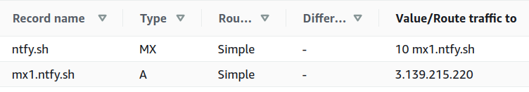

# Configuring the ntfy server
The ntfy server can be configured in three ways: using a config file (typically at `/etc/ntfy/server.yml`, 
see [server.yml](https://github.com/binwiederhier/ntfy/blob/main/config/server.yml)), via command line arguments 
or using environment variables.

## Quick start
By default, simply running `ntfy serve` will start the server at port 80. No configuration needed. Batteries included 😀. 
If everything works as it should, you'll see something like this:
```
$ ntfy serve
2021/11/30 19:59:08 Listening on :80
```

You can immediately start [publishing messages](publish.md), or subscribe via the [Android app](subscribe/phone.md),
[the web UI](subscribe/web.md), or simply via [curl or your favorite HTTP client](subscribe/api.md). To configure 
the server further, check out the [config options table](#config-options) or simply type `ntfy serve --help` to
get a list of [command line options](#command-line-options).

## Message cache
If desired, ntfy can temporarily keep notifications in an in-memory or an on-disk cache. Caching messages for a short period
of time is important to allow [phones](subscribe/phone.md) and other devices with brittle Internet connections to be able to retrieve
notifications that they may have missed. 

By default, ntfy keeps messages **in-memory for 12 hours**, which means that **cached messages do not survive an application
restart**. You can override this behavior using the following config settings:

* `cache-file`: if set, ntfy will store messages in a SQLite based cache (default is empty, which means in-memory cache).
  **This is required if you'd like messages to be retained across restarts**.
* `cache-duration`: defines the duration for which messages are stored in the cache (default is `12h`). 

You can also entirely disable the cache by setting `cache-duration` to `0`. When the cache is disabled, messages are only
passed on to the connected subscribers, but never stored on disk or even kept in memory longer than is needed to forward
the message to the subscribers.

Subscribers can retrieve cached messaging using the [`poll=1` parameter](subscribe/api.md#poll-for-messages), as well as the
[`since=` parameter](subscribe/api.md#fetch-cached-messages).

## Attachments
If desired, you may allow users to upload and [attach files to notifications](publish.md#attachments-send-files). To enable
this feature, you have to simply configure an attachment cache directory and a base URL (`attachment-cache-dir`, `base-url`). 
Once these options are set and the directory is writable by the server user, you can upload attachments via PUT.

By default, attachments are stored in the disk-case **for only 3 hours**. The main reason for this is to avoid legal issues
and such when hosting user controlled content. Typically, this is more than enough time for the user (or the phone) to download 
the file. The following config options are relevant to attachments:

* `base-url` is the root URL for the ntfy server; this is needed for the generated attachment URLs
* `attachment-cache-dir` is the cache directory for attached files
* `attachment-total-size-limit` is the size limit of the on-disk attachment cache (default: 5G)
* `attachment-file-size-limit` is the per-file attachment size limit (e.g. 300k, 2M, 100M, default: 15M)
* `attachment-expiry-duration` is the duration after which uploaded attachments will be deleted (e.g. 3h, 20h, default: 3h)

Here's an example config using mostly the defaults (except for the cache directory, which is empty by default): 

=== "/etc/ntfy/server.yml (minimal)"
    ``` yaml
    base-url: "https://ntfy.sh"
    attachment-cache-dir: "/var/cache/ntfy/attachments"
    ```

=== "/etc/ntfy/server.yml (all options)"
    ``` yaml
    base-url: "https://ntfy.sh"
    attachment-cache-dir: "/var/cache/ntfy/attachments"
    attachment-total-size-limit: "5G"
    attachment-file-size-limit: "15M"
    attachment-expiry-duration: "3h"
    visitor-attachment-total-size-limit: "100M"
    visitor-attachment-daily-bandwidth-limit: "500M"
    ```

Please also refer to the [rate limiting](#rate-limiting) settings below, specifically `visitor-attachment-total-size-limit`
and `visitor-attachment-daily-bandwidth-limit`. Setting these conservatively is necessary to avoid abuse.

## E-mail notifications
To allow forwarding messages via e-mail, you can configure an **SMTP server for outgoing messages**. Once configured, 
you can set the `X-Email` header to [send messages via e-mail](publish.md#e-mail-notifications) (e.g. 
`curl -d "hi there" -H "X-Email: phil@example.com" ntfy.sh/mytopic`).

As of today, only SMTP servers with PLAIN auth and STARTLS are supported. To enable e-mail sending, you must set the 
following settings:

* `base-url` is the root URL for the ntfy server; this is needed for e-mail footer
* `smtp-sender-addr` is the hostname:port of the SMTP server
* `smtp-sender-user` and `smtp-sender-pass` are the username and password of the SMTP user
* `smtp-sender-from` is the e-mail address of the sender

Here's an example config using [Amazon SES](https://aws.amazon.com/ses/) for outgoing mail (this is how it is 
configured for `ntfy.sh`):

=== "/etc/ntfy/server.yml"
    ``` yaml
    base-url: "https://ntfy.sh"
    smtp-sender-addr: "email-smtp.us-east-2.amazonaws.com:587"
    smtp-sender-user: "AKIDEADBEEFAFFE12345"
    smtp-sender-pass: "Abd13Kf+sfAk2DzifjafldkThisIsNotARealKeyOMG."
    smtp-sender-from: "ntfy@ntfy.sh"
    ```

Please also refer to the [rate limiting](#rate-limiting) settings below, specifically `visitor-email-limit-burst` 
and `visitor-email-limit-burst`. Setting these conservatively is necessary to avoid abuse.

## E-mail publishing
To allow publishing messages via e-mail, ntfy can run a lightweight **SMTP server for incoming messages**. Once configured, 
users can [send emails to a topic e-mail address](publish.md#e-mail-publishing) (e.g. `mytopic@ntfy.sh` or 
`myprefix-mytopic@ntfy.sh`) to publish messages to a topic. This is useful for e-mail based integrations such as for 
statuspage.io (though these days most services also support webhooks and HTTP calls).

To configure the SMTP server, you must at least set `smtp-server-listen` and `smtp-server-domain`:

* `smtp-server-listen` defines the IP address and port the SMTP server will listen on, e.g. `:25` or `1.2.3.4:25`
* `smtp-server-domain` is the e-mail domain, e.g. `ntfy.sh`
* `smtp-server-addr-prefix` is an optional prefix for the e-mail addresses to prevent spam. If set to `ntfy-`, for instance,
  only e-mails to `ntfy-$topic@ntfy.sh` will be accepted. If this is not set, all emails to `$topic@ntfy.sh` will be
  accepted (which may obviously be a spam problem).

Here's an example config (this is how it is configured for `ntfy.sh`):

=== "/etc/ntfy/server.yml"
    ``` yaml
    smtp-server-listen: ":25"
    smtp-server-domain: "ntfy.sh"
    smtp-server-addr-prefix: "ntfy-"
    ```

In addition to configuring the ntfy server, you have to create two DNS records (an [MX record](https://en.wikipedia.org/wiki/MX_record) 
and a corresponding A record), so incoming mail will find its way to your server. Here's an example of how `ntfy.sh` is 
configured (in [Amazon Route 53](https://aws.amazon.com/route53/)):

<figure markdown>
  { width=600 }
  <figcaption>DNS records for incoming mail</figcaption>
</figure>

## Behind a proxy (TLS, etc.)
!!! warning
    If you are running ntfy behind a proxy, you must set the `behind-proxy` flag. Otherwise, all visitors are
    [rate limited](#rate-limiting) as if they are one.

It may be desirable to run ntfy behind a proxy (e.g. nginx, HAproxy or Apache), so you can provide TLS certificates 
using Let's Encrypt using certbot, or simply because you'd like to share the ports (80/443) with other services. 
Whatever your reasons may be, there are a few things to consider. 

If you are running ntfy behind a proxy, you should set the `behind-proxy` flag. This will instruct the 
[rate limiting](#rate-limiting) logic to use the `X-Forwarded-For` header as the primary identifier for a visitor, 
as opposed to the remote IP address. If the `behind-proxy` flag is not set, all visitors will
be counted as one, because from the perspective of the ntfy server, they all share the proxy's IP address.

=== "/etc/ntfy/server.yml"
    ``` yaml
    # Tell ntfy to use "X-Forwarded-For" to identify visitors
    behind-proxy: true
    ```

### TLS/SSL
ntfy supports HTTPS/TLS by setting the `listen-https` [config option](#config-options). However, if you 
are behind a proxy, it is recommended that TLS/SSL termination is done by the proxy itself (see below).

I highly recommend using [certbot](https://certbot.eff.org/). I use it with the [dns-route53 plugin](https://certbot-dns-route53.readthedocs.io/en/stable/), 
which lets you use [AWS Route 53](https://aws.amazon.com/route53/) as the challenge. That's much easier than using the
HTTP challenge. I've found [this guide](https://nandovieira.com/using-lets-encrypt-in-development-with-nginx-and-aws-route53) to
be incredibly helpful.

### nginx/Apache2/caddy
For your convenience, here's a working config that'll help configure things behind a proxy. In this 
example, ntfy runs on `:2586` and we proxy traffic to it. We also redirect HTTP to HTTPS for GET requests against a topic
or the root domain:

=== "nginx (/etc/nginx/sites-*/ntfy)"
    ```
    server {
      listen 80;
      server_name ntfy.sh;

      location / {
        # Redirect HTTP to HTTPS, but only for GET topic addresses, since we want 
        # it to work with curl without the annoying https:// prefix
        set $redirect_https "";
        if ($request_method = GET) {
          set $redirect_https "yes";
        }
        if ($request_uri ~* "^/([-_a-z0-9]{0,64}$|docs/|static/)") {
          set $redirect_https "${redirect_https}yes";
        }
        if ($redirect_https = "yesyes") {
          return 302 https://$http_host$request_uri$is_args$query_string;
        }

        proxy_pass http://127.0.0.1:2586;
        proxy_http_version 1.1;
    
        proxy_buffering off;
        proxy_request_buffering off;
        proxy_redirect off;
     
        proxy_set_header Host $http_host;
        proxy_set_header X-Forwarded-For $proxy_add_x_forwarded_for;
    
        proxy_connect_timeout 3m;
        proxy_send_timeout 3m;
        proxy_read_timeout 3m;

        client_max_body_size 20m; # Must be >= attachment-file-size-limit in /etc/ntfy/server.yml
      }
    }
    
    server {
      listen 443 ssl;
      server_name ntfy.sh;
    
      ssl_session_cache builtin:1000 shared:SSL:10m;
      ssl_protocols TLSv1 TLSv1.1 TLSv1.2;
      ssl_ciphers HIGH:!aNULL:!eNULL:!EXPORT:!CAMELLIA:!DES:!MD5:!PSK:!RC4;
      ssl_prefer_server_ciphers on;
    
      ssl_certificate /etc/letsencrypt/live/ntfy.sh/fullchain.pem;
      ssl_certificate_key /etc/letsencrypt/live/ntfy.sh/privkey.pem;
    
      location / {
        proxy_pass http://127.0.0.1:2586;
        proxy_http_version 1.1;

        proxy_buffering off;
        proxy_request_buffering off;
        proxy_redirect off;
     
        proxy_set_header Host $http_host;
        proxy_set_header X-Forwarded-For $proxy_add_x_forwarded_for;
    
        proxy_connect_timeout 3m;
        proxy_send_timeout 3m;
        proxy_read_timeout 3m;
        
        client_max_body_size 20m; # Must be >= attachment-file-size-limit in /etc/ntfy/server.yml
      }
    }
    ```

=== "Apache2 (/etc/apache2/sites-*/ntfy.conf)"
    ```
    <VirtualHost *:80>
        ServerName ntfy.sh
        
        SetEnv proxy-nokeepalive 1
        SetEnv proxy-sendchunked 1
        
        ProxyPass / http://127.0.0.1:2586/
        ProxyPassReverse / http://127.0.0.1:2586/
        
        # Higher than the max message size of 4096 bytes
        LimitRequestBody 102400
        
        # Redirect HTTP to HTTPS, but only for GET topic addresses, since we want 
        # it to work with curl without the annoying https:// prefix 
        RewriteEngine on
        RewriteCond %{REQUEST_METHOD} GET
        RewriteRule ^/([-_A-Za-z0-9]{0,64})$ https://%{SERVER_NAME}/$1 [R,L]
    </VirtualHost>
    
    <VirtualHost *:443>
        ServerName ntfy.sh
        
        SSLEngine on
        SSLCertificateFile /etc/letsencrypt/live/ntfy.sh/fullchain.pem
        SSLCertificateKeyFile /etc/letsencrypt/live/ntfy.sh/privkey.pem
        Include /etc/letsencrypt/options-ssl-apache.conf
        
        SetEnv proxy-nokeepalive 1
        SetEnv proxy-sendchunked 1
        
        ProxyPass / http://127.0.0.1:2586/
        ProxyPassReverse / http://127.0.0.1:2586/
        
        # Higher than the max message size of 4096 bytes 
        LimitRequestBody 102400
        
        # Redirect HTTP to HTTPS, but only for GET topic addresses, since we want 
        # it to work with curl without the annoying https:// prefix 
        RewriteEngine on
        RewriteCond %{REQUEST_METHOD} GET
        RewriteRule ^/([-_A-Za-z0-9]{0,64})$ https://%{SERVER_NAME}/$1 [R,L]
    </VirtualHost>
    ```

=== "caddy"
    ```
    # Note that this config is most certainly incomplete. Please help out and let me know what's missing
    # via Discord/Matrix or in a GitHub issue.

    ntfy.sh {
        reverse_proxy 127.0.0.1:2586
    }
    http://nfty.sh {
        reverse_proxy 127.0.0.1:2586
    }
    ```

## Firebase (FCM)
!!! info
    Using Firebase is **optional** and only works if you modify and [build your own Android .apk](develop.md#android-app).
    For a self-hosted instance, it's easier to just not bother with FCM.

[Firebase Cloud Messaging (FCM)](https://firebase.google.com/docs/cloud-messaging) is the Google approved way to send
push messages to Android devices. FCM is the only method that an Android app can receive messages without having to run a
[foreground service](https://developer.android.com/guide/components/foreground-services).

For the main host [ntfy.sh](https://ntfy.sh), the [ntfy Android app](subscribe/phone.md) uses Firebase to send messages
to the device. For other hosts, instant delivery is used and FCM is not involved.

To configure FCM for your self-hosted instance of the ntfy server, follow these steps:

1. Sign up for a [Firebase account](https://console.firebase.google.com/)
2. Create a Firebase app and download the key file (e.g. `myapp-firebase-adminsdk-...json`)
3. Place the key file in `/etc/ntfy`, set the `firebase-key-file` in `server.yml` accordingly and restart the ntfy server
4. Build your own Android .apk following [these instructions](develop.md#android-app)

Example:
```
# If set, also publish messages to a Firebase Cloud Messaging (FCM) topic for your app.
# This is optional and only required to support Android apps (which don't allow background services anymore).
#
firebase-key-file: "/etc/ntfy/ntfy-sh-firebase-adminsdk-ahnce-9f4d6f14b5.json"
```

## Rate limiting
!!! info
    Be aware that if you are running ntfy behind a proxy, you must set the `behind-proxy` flag. 
    Otherwise, all visitors are rate limited as if they are one.

By default, ntfy runs without authentication, so it is vitally important that we protect the server from abuse or overload.
There are various limits and rate limits in place that you can use to configure the server:

* **Global limit**: A global limit applies across all visitors (IPs, clients, users)
* **Visitor limit**: A visitor limit only applies to a certain visitor. A **visitor** is identified by its IP address 
  (or the `X-Forwarded-For` header if `behind-proxy` is set). All config options that start with the word `visitor` apply 
  only on a per-visitor basis.

During normal usage, you shouldn't encounter these limits at all, and even if you burst a few requests or emails
(e.g. when you reconnect after a connection drop), it shouldn't have any effect.

### General limits
Let's do the easy limits first:

* `global-topic-limit` defines the total number of topics before the server rejects new topics. It defaults to 15,000.
* `visitor-subscription-limit` is the number of subscriptions (open connections) per visitor. This value defaults to 30.

### Request limits
In addition to the limits above, there is a requests/second limit per visitor for all sensitive GET/PUT/POST requests.
This limit uses a [token bucket](https://en.wikipedia.org/wiki/Token_bucket) (using Go's [rate package](https://pkg.go.dev/golang.org/x/time/rate)):

Each visitor has a bucket of 60 requests they can fire against the server (defined by `visitor-request-limit-burst`). 
After the 60, new requests will encounter a `429 Too Many Requests` response. The visitor request bucket is refilled at a rate of one
request every 10s (defined by `visitor-request-limit-replenish`)

* `visitor-request-limit-burst` is the initial bucket of requests each visitor has. This defaults to 60.
* `visitor-request-limit-replenish` is the rate at which the bucket is refilled (one request per x). Defaults to 10s.

### Attachment limits

XXXXXXXXXXXXXXXXXXXXXXXXXXXXXXx

### E-mail limits
Similarly to the request limit, there is also an e-mail limit (only relevant if [e-mail notifications](#e-mail-notifications) 
are enabled):

* `visitor-email-limit-burst` is the initial bucket of emails each visitor has. This defaults to 16.
* `visitor-email-limit-replenish` is the rate at which the bucket is refilled (one email per x). Defaults to 1h.

## Tuning for scale
If you're running ntfy for your home server, you probably don't need to worry about scale at all. In its default config,
if it's not behind a proxy, the ntfy server can keep about **as many connections as the open file limit allows**.
This limit is typically called `nofile`. Other than that, RAM and CPU are obviously relevant. You may also want to check
out [this discussion on Reddit](https://www.reddit.com/r/golang/comments/r9u4ee/how_many_actively_connected_http_clients_can_a_go/).

Depending on *how you run it*, here are a few limits that are relevant:

### For systemd services
If you're running ntfy in a systemd service (e.g. for .deb/.rpm packages), the main limiting factor is the
`LimitNOFILE` setting in the systemd unit. The default open files limit for `ntfy.service` is 10,000. You can override it
by creating a `/etc/systemd/system/ntfy.service.d/override.conf` file. As far as I can tell, `/etc/security/limits.conf`
is not relevant.

=== "/etc/systemd/system/ntfy.service.d/override.conf"
    ```
    # Allow 20,000 ntfy connections (and give room for other file handles)
    [Service]
    LimitNOFILE=20500
    ```

### Outside of systemd
If you're running outside systemd, you may want to adjust your `/etc/security/limits.conf` file to
increase the `nofile` setting. Here's an example that increases the limit to 5,000. You can find out the current setting
by running `ulimit -n`, or manually override it temporarily by running `ulimit -n 50000`.

=== "/etc/security/limits.conf"
    ```
    # Increase open files limit globally
    * hard nofile 20500
    ```

### Proxy limits (nginx, Apache2)
If you are running [behind a proxy](#behind-a-proxy-tls-etc) (e.g. nginx, Apache), the open files limit of the proxy is also
relevant. So if your proxy runs inside of systemd, increase the limits in systemd for the proxy. Typically, the proxy
open files limit has to be **double the number of how many connections you'd like to support**, because the proxy has
to maintain the client connection and the connection to ntfy.

=== "/etc/nginx/nginx.conf"
    ```
    events {
      # Allow 40,000 proxy connections (2x of the desired ntfy connection count;
      # and give room for other file handles)
      worker_connections 40500;
    }
    ```

=== "/etc/systemd/system/nginx.service.d/override.conf"
    ```
    # Allow 40,000 proxy connections (2x of the desired ntfy connection count;
    # and give room for other file handles)
    [Service]
    LimitNOFILE=40500
    ```

### Banning bad actors (fail2ban)
If you put stuff on the Internet, bad actors will try to break them or break in. [fail2ban](https://www.fail2ban.org/)
and nginx's [ngx_http_limit_req_module module](http://nginx.org/en/docs/http/ngx_http_limit_req_module.html) can be used
to ban client IPs if they misbehave. This is on top of the [rate limiting](#rate-limiting) inside the ntfy server.

Here's an example for how ntfy.sh is configured, following the instructions from two tutorials ([here](https://easyengine.io/tutorials/nginx/fail2ban/) 
and [here](https://easyengine.io/tutorials/nginx/block-wp-login-php-bruteforce-attack/)):

=== "/etc/nginx/nginx.conf"
    ```
    http {
	  limit_req_zone $binary_remote_addr zone=one:10m rate=1r/s;
    }
    ```

=== "/etc/nginx/sites-enabled/ntfy.sh"
    ```
    # For each server/location block
    server {
      location / {
        limit_req zone=one burst=1000 nodelay;
      }
    }    
    ```

=== "/etc/fail2ban/filter.d/nginx-req-limit.conf"
    ```
    [Definition]
    failregex = limiting requests, excess:.* by zone.*client: <HOST>
    ignoreregex =
    ```

=== "/etc/fail2ban/jail.local"
    ```
    [nginx-req-limit]
    enabled = true
    filter = nginx-req-limit
    action = iptables-multiport[name=ReqLimit, port="http,https", protocol=tcp]
    logpath = /var/log/nginx/error.log
    findtime = 600
    bantime = 7200
    maxretry = 10
    ```

## Config options
Each config option can be set in the config file `/etc/ntfy/server.yml` (e.g. `listen-http: :80`) or as a
CLI option (e.g. `--listen-http :80`. Here's a list of all available options. Alternatively, you can set an environment
variable before running the `ntfy` command (e.g. `export NTFY_LISTEN_HTTP=:80`).

| Config option | Env variable | Format | Default | Description |
|---|---|---|---|---|
| `base-url` | `NTFY_BASE_URL` | *URL* | - | Public facing base URL of the service (e.g. `https://ntfy.sh`) |
| `listen-http` | `NTFY_LISTEN_HTTP` | `[host]:port` | `:80` | Listen address for the HTTP web server |
| `listen-https` | `NTFY_LISTEN_HTTPS` | `[host]:port` | - | Listen address for the HTTPS web server. If set, you also need to set `key-file` and `cert-file`. |
| `key-file` | `NTFY_KEY_FILE` | *filename* | - | HTTPS/TLS private key file, only used if `listen-https` is set. |
| `cert-file` | `NTFY_CERT_FILE` | *filename* | - | HTTPS/TLS certificate file, only used if `listen-https` is set. |
| `firebase-key-file` | `NTFY_FIREBASE_KEY_FILE` | *filename* | - | If set, also publish messages to a Firebase Cloud Messaging (FCM) topic for your app. This is optional and only required to save battery when using the Android app. See [Firebase (FCM](#firebase-fcm). |
| `cache-file` | `NTFY_CACHE_FILE` | *filename* | - | If set, messages are cached in a local SQLite database instead of only in-memory. This allows for service restarts without losing messages in support of the since= parameter. See [message cache](#message-cache). |
| `cache-duration` | `NTFY_CACHE_DURATION` | *duration* | 12h | Duration for which messages will be buffered before they are deleted. This is required to support the `since=...` and `poll=1` parameter. Set this to `0` to disable the cache entirely. |
| `attachment-cache-dir` | `NTFY_ATTACHMENT_CACHE_DIR` | *directory* | - | Cache directory for attached files. To enable attachments, this has to be set. |
| `attachment-total-size-limit` | `NTFY_ATTACHMENT_TOTAL_SIZE_LIMIT` | *size* | 5G | Limit of the on-disk attachment cache directory. If the limits is exceeded, new attachments will be rejected. |
| `attachment-file-size-limit` | `NTFY_ATTACHMENT_FILE_SIZE_LIMIT` | *size* | 15M | Per-file attachment size limit (e.g. 300k, 2M, 100M). Larger attachment will be rejected. |
| `attachment-expiry-duration` | `NTFY_ATTACHMENT_EXPIRY_DURATION` | *duration* | 3h | Duration after which uploaded attachments will be deleted (e.g. 3h, 20h). Strongly affects `visitor-attachment-total-size-limit`. |
| `keepalive-interval` | `NTFY_KEEPALIVE_INTERVAL` | *duration* | 55s | Interval in which keepalive messages are sent to the client. This is to prevent intermediaries closing the connection for inactivity. Note that the Android app has a hardcoded timeout at 77s, so it should be less than that. |
| `manager-interval` | `$NTFY_MANAGER_INTERVAL` | *duration* | 1m | Interval in which the manager prunes old messages, deletes topics and prints the stats. |
| `smtp-sender-addr` | `NTFY_SMTP_SENDER_ADDR` | `host:port` | - | SMTP server address to allow email sending |
| `smtp-sender-user` | `NTFY_SMTP_SENDER_USER` | *string* | - | SMTP user; only used if e-mail sending is enabled |
| `smtp-sender-pass` | `NTFY_SMTP_SENDER_PASS` | *string* | - | SMTP password; only used if e-mail sending is enabled |
| `smtp-sender-from` | `NTFY_SMTP_SENDER_FROM` | *e-mail address* | - | SMTP sender e-mail address; only used if e-mail sending is enabled |
| `smtp-server-listen` | `NTFY_SMTP_SERVER_LISTEN` | `[ip]:port` | - | Defines the IP address and port the SMTP server will listen on, e.g. `:25` or `1.2.3.4:25` |
| `smtp-server-domain` | `NTFY_SMTP_SERVER_DOMAIN` | *domain name* | - | SMTP server e-mail domain, e.g. `ntfy.sh` |
| `smtp-server-addr-prefix` | `NTFY_SMTP_SERVER_ADDR_PREFIX` | `[ip]:port` | - |  Optional prefix for the e-mail addresses to prevent spam, e.g. `ntfy-` |
| `global-topic-limit` | `NTFY_GLOBAL_TOPIC_LIMIT` | *number* | 15,000 | Rate limiting: Total number of topics before the server rejects new topics. |
| `visitor-subscription-limit` | `NTFY_VISITOR_SUBSCRIPTION_LIMIT` | *number* | 30 | Rate limiting: Number of subscriptions per visitor (IP address) |
| `visitor-attachment-total-size-limit` | `NTFY_VISITOR_ATTACHMENT_TOTAL_SIZE_LIMIT` | *size* | 100M | Total storage limit used for attachments per visitor, for all attachments combined. Storage is freed after attachments expire. See `attachment-expiry-duration`. |
| `visitor-attachment-daily-bandwidth-limit` | `NTFY_VISITOR_ATTACHMENT_DAILY_BANDWIDTH_LIMIT` | *size* | 500M | Total daily attachment download/upload traffic limit per visitor. This is to protect your bandwidth costs from exploding. |
| `visitor-request-limit-burst` | `NTFY_VISITOR_REQUEST_LIMIT_BURST` | *number* | 60 | Allowed GET/PUT/POST requests per second, per visitor. This setting is the initial bucket of requests each visitor has |
| `visitor-request-limit-replenish` | `NTFY_VISITOR_REQUEST_LIMIT_REPLENISH` | *duration* | 10s | Strongly related to `visitor-request-limit-burst`: The rate at which the bucket is refilled |
| `visitor-email-limit-burst` | `NTFY_VISITOR_EMAIL_LIMIT_BURST` | *number* | 16 | Initial limit of e-mails per visitor |
| `visitor-email-limit-replenish` | `NTFY_VISITOR_EMAIL_LIMIT_REPLENISH` | *duration* | 1h | Strongly related to `visitor-email-limit-burst`: The rate at which the bucket is refilled |
| `behind-proxy` | `NTFY_BEHIND_PROXY` | *bool* | false | If set, the X-Forwarded-For header is used to determine the visitor IP address instead of the remote address of the connection. |

The format for a *duration* is: `<number>(smh)`, e.g. 30s, 20m or 1h.   
The format for a *size* is: `<number>(GMK)`, e.g. 1G, 200M or 4000k.

## Command line options
```
$ ntfy serve --help
NAME:
   main serve - Run the ntfy server

USAGE:
   ntfy serve [OPTIONS..]

DESCRIPTION:
   Run the ntfy server and listen for incoming requests
   
   The command will load the configuration from /etc/ntfy/server.yml. Config options can 
   be overridden using the command line options.
   
   Examples:
     ntfy serve                      # Starts server in the foreground (on port 80)
     ntfy serve --listen-http :8080  # Starts server with alternate port

OPTIONS:
   --config value, -c value                          config file (default: /etc/ntfy/server.yml) [$NTFY_CONFIG_FILE]
   --base-url value, -B value                        externally visible base URL for this host (e.g. https://ntfy.sh) [$NTFY_BASE_URL]
   --listen-http value, -l value                     ip:port used to as HTTP listen address (default: ":80") [$NTFY_LISTEN_HTTP]
   --listen-https value, -L value                    ip:port used to as HTTPS listen address [$NTFY_LISTEN_HTTPS]
   --key-file value, -K value                        private key file, if listen-https is set [$NTFY_KEY_FILE]
   --cert-file value, -E value                       certificate file, if listen-https is set [$NTFY_CERT_FILE]
   --firebase-key-file value, -F value               Firebase credentials file; if set additionally publish to FCM topic [$NTFY_FIREBASE_KEY_FILE]
   --cache-file value, -C value                      cache file used for message caching [$NTFY_CACHE_FILE]
   --cache-duration since, -b since                  buffer messages for this time to allow since requests (default: 12h0m0s) [$NTFY_CACHE_DURATION]
   --attachment-cache-dir value                      cache directory for attached files [$NTFY_ATTACHMENT_CACHE_DIR]
   --attachment-total-size-limit value, -A value     limit of the on-disk attachment cache (default: 5G) [$NTFY_ATTACHMENT_TOTAL_SIZE_LIMIT]
   --attachment-file-size-limit value, -Y value      per-file attachment size limit (e.g. 300k, 2M, 100M) (default: 15M) [$NTFY_ATTACHMENT_FILE_SIZE_LIMIT]
   --attachment-expiry-duration value, -X value      duration after which uploaded attachments will be deleted (e.g. 3h, 20h) (default: 3h) [$NTFY_ATTACHMENT_EXPIRY_DURATION]
   --keepalive-interval value, -k value              interval of keepalive messages (default: 55s) [$NTFY_KEEPALIVE_INTERVAL]
   --manager-interval value, -m value                interval of for message pruning and stats printing (default: 1m0s) [$NTFY_MANAGER_INTERVAL]
   --smtp-sender-addr value                          SMTP server address (host:port) for outgoing emails [$NTFY_SMTP_SENDER_ADDR]
   --smtp-sender-user value                          SMTP user (if e-mail sending is enabled) [$NTFY_SMTP_SENDER_USER]
   --smtp-sender-pass value                          SMTP password (if e-mail sending is enabled) [$NTFY_SMTP_SENDER_PASS]
   --smtp-sender-from value                          SMTP sender address (if e-mail sending is enabled) [$NTFY_SMTP_SENDER_FROM]
   --smtp-server-listen value                        SMTP server address (ip:port) for incoming emails, e.g. :25 [$NTFY_SMTP_SERVER_LISTEN]
   --smtp-server-domain value                        SMTP domain for incoming e-mail, e.g. ntfy.sh [$NTFY_SMTP_SERVER_DOMAIN]
   --smtp-server-addr-prefix value                   SMTP email address prefix for topics to prevent spam (e.g. 'ntfy-') [$NTFY_SMTP_SERVER_ADDR_PREFIX]
   --global-topic-limit value, -T value              total number of topics allowed (default: 15000) [$NTFY_GLOBAL_TOPIC_LIMIT]
   --visitor-subscription-limit value                number of subscriptions per visitor (default: 30) [$NTFY_VISITOR_SUBSCRIPTION_LIMIT]
   --visitor-attachment-total-size-limit value       total storage limit used for attachments per visitor (default: "100M") [$NTFY_VISITOR_ATTACHMENT_TOTAL_SIZE_LIMIT]
   --visitor-attachment-daily-bandwidth-limit value  total daily attachment download/upload bandwidth limit per visitor (default: "500M") [$NTFY_VISITOR_ATTACHMENT_DAILY_BANDWIDTH_LIMIT]
   --visitor-request-limit-burst value               initial limit of requests per visitor (default: 60) [$NTFY_VISITOR_REQUEST_LIMIT_BURST]
   --visitor-request-limit-replenish value           interval at which burst limit is replenished (one per x) (default: 10s) [$NTFY_VISITOR_REQUEST_LIMIT_REPLENISH]
   --visitor-email-limit-burst value                 initial limit of e-mails per visitor (default: 16) [$NTFY_VISITOR_EMAIL_LIMIT_BURST]
   --visitor-email-limit-replenish value             interval at which burst limit is replenished (one per x) (default: 1h0m0s) [$NTFY_VISITOR_EMAIL_LIMIT_REPLENISH]
   --behind-proxy, -P                                if set, use X-Forwarded-For header to determine visitor IP address (for rate limiting) (default: false) [$NTFY_BEHIND_PROXY]
   --help, -h                                        show help (default: false)
```

