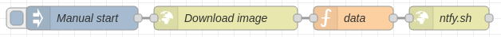

# Examples

There are a million ways to use ntfy, but here are some inspirations. I try to collect
<a href="https://github.com/binwiederhier/ntfy/tree/main/examples">examples on GitHub</a>, so be sure to check
those out, too.

!!! info
    Many of these examples were contributed by ntfy users. If you have other examples of how you use ntfy, please
    [create a pull request](https://github.com/binwiederhier/ntfy/pulls), and I'll happily include it. Also note, that
    I cannot guarantee that all of these examples are functional. Many of them I have not tried myself.

## Cronjobs
ntfy is perfect for any kind of cronjobs or just when long processes are done (backups, pipelines, rsync copy commands, ...).

I started adding notifications pretty much all of my scripts. Typically, I just chain the <tt>curl</tt> call
directly to the command I'm running. The following example will either send <i>Laptop backup succeeded</i>
or ⚠️ <i>Laptop backup failed</i> directly to my phone:

```
rsync -a root@laptop /backups/laptop \
  && zfs snapshot ... \
  && curl -H prio:low -d "Laptop backup succeeded" ntfy.sh/backups \
  || curl -H tags:warning -H prio:high -d "Laptop backup failed" ntfy.sh/backups
```

Here's one for the history books. I desperately want the `github.com/ntfy` organization, but all my tickets with
GitHub have been hopeless. In case it ever becomes available, I want to know immediately.

``` cron
# Check github/ntfy user
*/6 * * * * if curl -s https://api.github.com/users/ntfy | grep "Not Found"; then curl -d "github.com/ntfy is available" -H "Tags: tada" -H "Prio: high" ntfy.sh/my-alerts; fi
```


## Low disk space alerts
Here's a simple cronjob that I use to alert me when the disk space on the root disk is running low. It's simple, but 
effective. 

``` bash 
#!/bin/bash

mingigs=10
avail=$(df | awk '$6 == "/" && $4 < '$mingigs' * 1024*1024 { print $4/1024/1024 }')
topicurl=https://ntfy.sh/mytopic

if [ -n "$avail" ]; then
  curl \
    -d "Only $avail GB available on the root disk. Better clean that up." \
    -H "Title: Low disk space alert on $(hostname)" \
    -H "Priority: high" \
    -H "Tags: warning,cd" \
    $topicurl
fi
```

## SSH login alerts
Years ago my home server was broken into. That shook me hard, so every time someone logs into any machine that I
own, I now message myself. Here's an example of how to use <a href="https://en.wikipedia.org/wiki/Linux_PAM">PAM</a>
to notify yourself on SSH login.

=== "/etc/pam.d/sshd"
    ```
    # at the end of the file
    session optional pam_exec.so /usr/bin/ntfy-ssh-login.sh
    ```

=== "/usr/bin/ntfy-ssh-login.sh"
    ```bash
    #!/bin/bash
    if [ "${PAM_TYPE}" = "open_session" ]; then
      curl \
        -H prio:high \
        -H tags:warning \
        -d "SSH login: ${PAM_USER} from ${PAM_RHOST}" \
        ntfy.sh/alerts
    fi
    ```

## Collect data from multiple machines
The other day I was running tasks on 20 servers, and I wanted to collect the interim results
as a CSV in one place. Each of the servers was publishing to a topic as the results completed (`publish-result.sh`), 
and I had one central collector to grab the results as they came in (`collect-results.sh`).

It looked something like this:

=== "collect-results.sh"
    ```bash
    while read result; do
      [ -n "$result" ] && echo "$result" >> results.csv
    done < <(stdbuf -i0 -o0 curl -s ntfy.sh/results/raw)
    ```
=== "publish-result.sh" 
    ```bash
    // This script was run on each of the 20 servers. It was doing heavy processing ...
    
    // Publish script results
    curl -d "$(hostname),$count,$time" ntfy.sh/results
    ```

## Ansible, Salt and Puppet
You can easily integrate ntfy into Ansible, Salt, or Puppet to notify you when runs are done or are highstated.
One of my co-workers uses the following Ansible task to let him know when things are done:

```yml
- name: Send ntfy.sh update
  uri:
    url: "https://ntfy.sh/{{ ntfy_channel }}"
    method: POST
    body: "{{ inventory_hostname }} reseeding complete"
```

## Watchtower (shoutrrr)
You can use [shoutrrr](https://github.com/containrrr/shoutrrr) generic webhook support to send 
[Watchtower](https://github.com/containrrr/watchtower/) notifications to your ntfy topic.

Example docker-compose.yml:
```yml
services:
  watchtower:
    image: containrrr/watchtower
    environment:
      - WATCHTOWER_NOTIFICATIONS=shoutrrr
      - WATCHTOWER_NOTIFICATION_URL=generic+https://ntfy.sh/my_watchtower_topic?title=WatchtowerUpdates
```

Or, if you only want to send notifications using shoutrrr:
```
shoutrrr send -u "generic+https://ntfy.sh/my_watchtower_topic?title=WatchtowerUpdates" -m "testMessage"
```

## Sonarr, Radarr, Lidarr, Readarr, Prowlarr, SABnzbd
It's possible to use custom scripts for all the *arr services, plus SABnzbd. Notifications for downloads, warnings, grabs etc.
Some simple bash scripts to achieve this are kindly provided in [nickexyz's repository](https://github.com/nickexyz/ntfy-shellscripts). 

## Node-RED
You can use the HTTP request node to send messages with [Node-RED](https://nodered.org), some examples:

<details>
<summary>Example: Send a message (click to expand)</summary>

``` json
[
    {
        "id": "c956e688cc74ad8e",
        "type": "http request",
        "z": "fabdd7a3.4045a",
        "name": "ntfy.sh",
        "method": "POST",
        "ret": "txt",
        "paytoqs": "ignore",
        "url": "https://ntfy.sh/mytopic",
        "tls": "",
        "persist": false,
        "proxy": "",
        "authType": "",
        "senderr": false,
        "credentials":
        {
            "user": "",
            "password": ""
        },
        "x": 590,
        "y": 3160,
        "wires":
        [
            []
        ]
    },
    {
        "id": "32ee1eade51fae50",
        "type": "function",
        "z": "fabdd7a3.4045a",
        "name": "data",
        "func": "msg.payload = \"Something happened\";\nmsg.headers = {};\nmsg.headers['tags'] = 'house';\nmsg.headers['X-Title'] = 'Home Assistant';\n\nreturn msg;",
        "outputs": 1,
        "noerr": 0,
        "initialize": "",
        "finalize": "",
        "libs": [],
        "x": 470,
        "y": 3160,
        "wires":
        [
            [
                "c956e688cc74ad8e"
            ]
        ]
    },
    {
        "id": "b287e59cd2311815",
        "type": "inject",
        "z": "fabdd7a3.4045a",
        "name": "Manual start",
        "props":
        [
            {
                "p": "payload"
            },
            {
                "p": "topic",
                "vt": "str"
            }
        ],
        "repeat": "",
        "crontab": "",
        "once": false,
        "onceDelay": "20",
        "topic": "",
        "payload": "",
        "payloadType": "date",
        "x": 330,
        "y": 3160,
        "wires":
        [
            [
                "32ee1eade51fae50"
            ]
        ]
    }
]
```

</details>


<details>
<summary>Example: Send a picture (click to expand)</summary>

``` json
[
    {
        "id": "d135a13eadeb9d6d",
        "type": "http request",
        "z": "fabdd7a3.4045a",
        "name": "Download image",
        "method": "GET",
        "ret": "bin",
        "paytoqs": "ignore",
        "url": "https://www.google.com/images/branding/googlelogo/1x/googlelogo_color_272x92dp.png",
        "tls": "",
        "persist": false,
        "proxy": "",
        "authType": "",
        "senderr": false,
        "credentials":
        {
            "user": "",
            "password": ""
        },
        "x": 490,
        "y": 3320,
        "wires":
        [
            [
                "6e75bc41d2ec4a03"
            ]
        ]
    },
    {
        "id": "6e75bc41d2ec4a03",
        "type": "function",
        "z": "fabdd7a3.4045a",
        "name": "data",
        "func": "msg.payload = msg.payload;\nmsg.headers = {};\nmsg.headers['tags'] = 'house';\nmsg.headers['X-Title'] = 'Home Assistant - Picture';\n\nreturn msg;",
        "outputs": 1,
        "noerr": 0,
        "initialize": "",
        "finalize": "",
        "libs": [],
        "x": 650,
        "y": 3320,
        "wires":
        [
            [
                "eb160615b6ceda98"
            ]
        ]
    },
    {
        "id": "eb160615b6ceda98",
        "type": "http request",
        "z": "fabdd7a3.4045a",
        "name": "ntfy.sh",
        "method": "PUT",
        "ret": "bin",
        "paytoqs": "ignore",
        "url": "https://ntfy.sh/mytopic",
        "tls": "",
        "persist": false,
        "proxy": "",
        "authType": "",
        "senderr": false,
        "credentials":
        {
            "user": "",
            "password": ""
        },
        "x": 770,
        "y": 3320,
        "wires":
        [
            []
        ]
    },
    {
        "id": "5b8dbf15c8a7a3a5",
        "type": "inject",
        "z": "fabdd7a3.4045a",
        "name": "Manual start",
        "props":
        [
            {
                "p": "payload"
            },
            {
                "p": "topic",
                "vt": "str"
            }
        ],
        "repeat": "",
        "crontab": "",
        "once": false,
        "onceDelay": "20",
        "topic": "",
        "payload": "",
        "payloadType": "date",
        "x": 310,
        "y": 3320,
        "wires":
        [
            [
                "d135a13eadeb9d6d"
            ]
        ]
    }
]
```

</details>



## Gatus

An example for a custom alert with [Gatus](https://github.com/TwiN/gatus):
``` yaml
alerting:
  custom:
    url: "https://ntfy.sh"
    method: "POST"
    body: |
      {
        "topic": "mytopic",
        "message": "[ENDPOINT_NAME] - [ALERT_DESCRIPTION]",
        "title": "Gatus",
        "tags": ["[ALERT_TRIGGERED_OR_RESOLVED]"],
        "priority": 3
      }
    default-alert:
      enabled: true
      description: "health check failed"
      send-on-resolved: true
      failure-threshold: 3
      success-threshold: 3
    placeholders:
      ALERT_TRIGGERED_OR_RESOLVED:
        TRIGGERED: "warning"
        RESOLVED: "white_check_mark"
```

## Jellyseerr/Overseerr webhook
Here is an example for [jellyseerr](https://github.com/Fallenbagel/jellyseerr)/[overseerr](https://overseerr.dev/) webhook
JSON payload. Remember to change the `https://requests.example.com` to your jellyseerr/overseerr URL.

``` json
{
    "topic": "requests",
    "title": "{{event}}",
    "message": "{{subject}}\n{{message}}\n\nRequested by: {{requestedBy_username}}\n\nStatus: {{media_status}}\nRequest Id: {{request_id}}",
    "priority": 4,
    "attach": "{{image}}",
    "click": "https://requests.example.com/{{media_type}}/{{media_tmdbid}}"
}
```

## Home Assistant
Here is an example for the configuration.yml file to setup a REST notify component.
Since Home Assistant is going to POST JSON, you need to specify the root of your ntfy resource.

```yaml
notify:
  - name: ntfy
    platform: rest
    method: POST_JSON
    data:
      topic: YOUR_NTFY_TOPIC
    title_param_name: title
    message_param_name: message
    resource: https://ntfy.sh
```

If you need to authenticate to your ntfy resource, define the authentication, username and password as below:

```yaml
notify:
  - name: ntfy
    platform: rest
    method: POST_JSON
    authentication: basic
    username: YOUR_USERNAME
    password: YOUR_PASSWORD
    data:
      topic: YOUR_NTFY_TOPIC
    title_param_name: title
    message_param_name: message
    resource: https://ntfy.sh
```

If you need to add any other [ntfy specific parameters](https://ntfy.sh/docs/publish/#publish-as-json) such as priority, tags, etc., add them to the `data` array in the example yml. For example:

```yaml
notify:
  - name: ntfy
    platform: rest
    method: POST_JSON
    data:
      topic: YOUR_NTFY_TOPIC
      priority: 4
    title_param_name: title
    message_param_name: message
    resource: https://ntfy.sh
```

## Uptime Kuma
Go to your [Uptime Kuma](https://github.com/louislam/uptime-kuma) Settings > Notifications, click on **Setup Notification**.
Then set your desired **title** (e.g. "Uptime Kuma"), **ntfy topic**, **Server URL** and **priority (1-5)**:

<div id="uptimekuma-screenshots" class="screenshots">
    <a href="../static/img/uptimekuma-settings.png"></a>
    <a href="../static/img/uptimekuma-setup.png"></a>
</div>

You can now test the notifications and apply them to monitors:

<div id="uptimekuma-monitor-screenshots" class="screenshots">
    <a href="../static/img/uptimekuma-ios-test.jpg"></a>
    <a href="../static/img/uptimekuma-ios-down.jpg"></a>
    <a href="../static/img/uptimekuma-ios-up.jpg"></a>
</div>

## UptimeRobot
Go to your [UptimeRobot](https://github.com/uptimerobot) My Settings > Alert Contacts > Add Alert Contact
Select **Alert Contact Type** = Webhook. Then set your desired **Friendly Name** (e.g. "ntfy-sh-UP"), **URL to Notify**, **POST value** and select checkbox **Send as JSON (application/json)**. Make sure to send the JSON POST request to ntfy.domain.com without the topic name in the url and include the "topic" name in the JSON body.

<div id="uptimerobot-monitor-setup" class="screenshots">
    <a href="../static/img/uptimerobot-setup.jpg"></a>
</div>

```
{
    "topic":"myTopic",
    "title": "*monitorFriendlyName* *alertTypeFriendlyName*",
    "message": "*alertDetails*", 
    "tags": ["green_circle"],
    "priority": 3,
    "click": https://uptimerobot.com/dashboard#*monitorID*
}
```
You can create two Alert Contacts each with a different icon and priority, for example:

```
{
    "topic":"myTopic",
    "title": "*monitorFriendlyName* *alertTypeFriendlyName*",
    "message": "*alertDetails*", 
    "tags": ["red_circle"],
    "priority": 3,
    "click": https://uptimerobot.com/dashboard#*monitorID*
}
```
You can now add the created Alerts Contact(s) to the monitor(s) and test the notifications:

<div id="uptimerobot-monitor-screenshots" class="screenshots">
    <a href="../static/img/uptimerobot-test.jpg"></a>
</div>


## Apprise
ntfy is integrated natively into [Apprise](https://github.com/caronc/apprise) (also check out the 
[Apprise/ntfy wiki page](https://github.com/caronc/apprise/wiki/Notify_ntfy)).

You can use it like this:

```
apprise -vv -t "Test Message Title" -b "Test Message Body" \
   ntfy://mytopic
```

Or with your own server like this:

```
apprise -vv -t "Test Message Title" -b "Test Message Body" \
   ntfy://ntfy.example.com/mytopic
```

