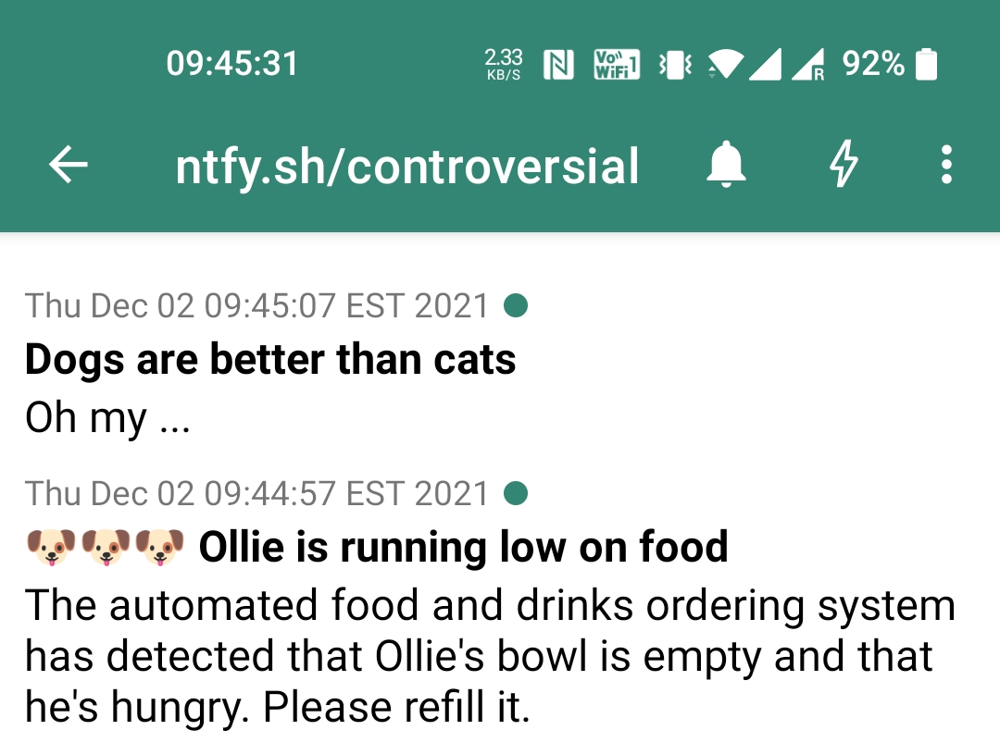
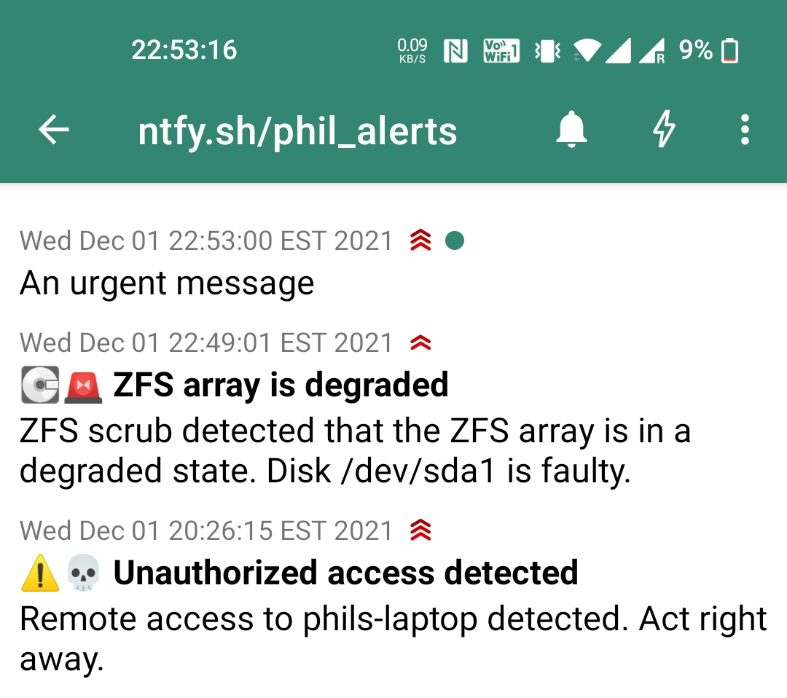
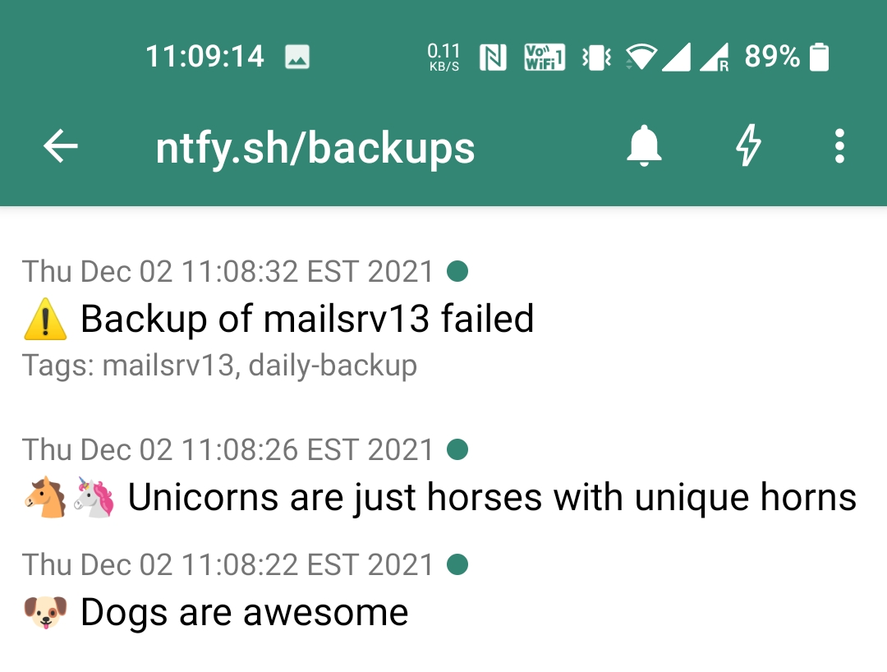
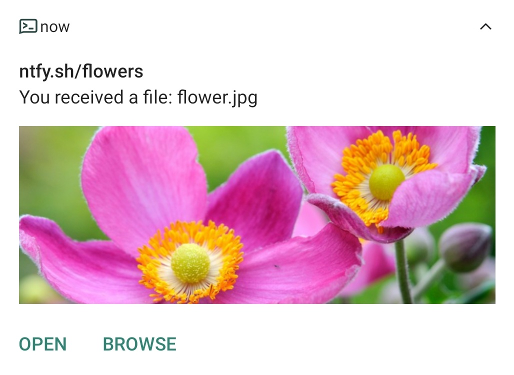
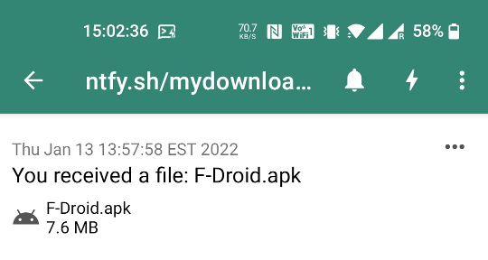
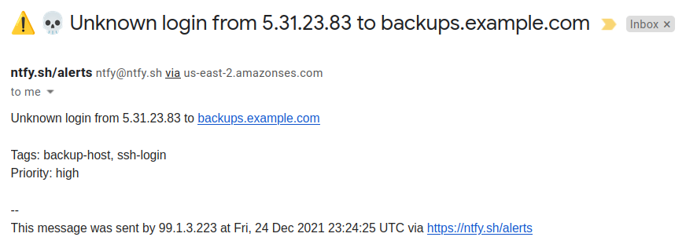
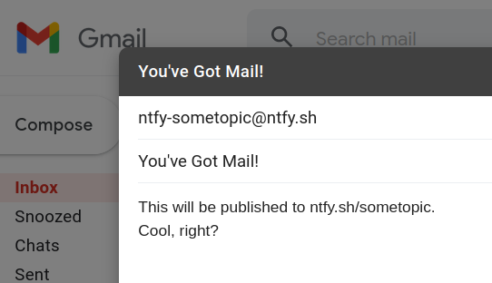

# Publishing
Publishing messages can be done via HTTP PUT/POST or via the [ntfy CLI](install.md). Topics are created on the fly by 
subscribing or publishing to them. Because there is no sign-up, **the topic is essentially a password**, so pick 
something that's not easily guessable.

Here's an example showing how to publish a simple message using a POST request:

=== "Command line (curl)"
    ```
    curl -d "Backup successful 😀" ntfy.sh/mytopic
    ```

=== "ntfy CLI"
    ```
    ntfy publish mytopic "Backup successful 😀"
    ```

=== "HTTP"
    ``` http
    POST /mytopic HTTP/1.1
    Host: ntfy.sh

    Backup successful 😀
    ```
=== "JavaScript"
    ``` javascript
    fetch('https://ntfy.sh/mytopic', {
      method: 'POST', // PUT works too
      body: 'Backup successful 😀'
    })
    ```

=== "Go"
    ``` go
    http.Post("https://ntfy.sh/mytopic", "text/plain",
        strings.NewReader("Backup successful 😀"))
    ```

=== "PowerShell"
    ``` powershell
    Invoke-RestMethod -Method 'Post' -Uri https://ntfy.sh/topic -Body "Backup successful 😀" -UseBasicParsing
    ```

=== "Python"
    ``` python
    requests.post("https://ntfy.sh/mytopic", 
        data="Backup successful 😀".encode(encoding='utf-8'))
    ```

=== "PHP"
    ``` php-inline
    file_get_contents('https://ntfy.sh/mytopic', false, stream_context_create([
        'http' => [
            'method' => 'POST', // PUT also works
            'header' => 'Content-Type: text/plain',
            'content' => 'Backup successful 😀'
        ]
    ]));
    ```

If you have the [Android app](subscribe/phone.md) installed on your phone, this will create a notification that looks like this:

<figure markdown>
  { width=500 }
  <figcaption>Android notification</figcaption>
</figure>

There are more features related to publishing messages: You can set a [notification priority](#message-priority), 
a [title](#message-title), and [tag messages](#tags-emojis) 🥳 🎉. Here's an example that uses some of them at together:

=== "Command line (curl)"
    ```
    curl \
      -H "Title: Unauthorized access detected" \
      -H "Priority: urgent" \
      -H "Tags: warning,skull" \
      -d "Remote access to phils-laptop detected. Act right away." \
      ntfy.sh/phil_alerts
    ```

=== "ntfy CLI"
    ```
    ntfy publish \
        --title "Unauthorized access detected" \
        --tags warning,skull \
        --priority urgent \
        mytopic \
        "Remote access to phils-laptop detected. Act right away."
    ```

=== "HTTP"
    ``` http
    POST /phil_alerts HTTP/1.1
    Host: ntfy.sh
    Title: Unauthorized access detected
    Priority: urgent
    Tags: warning,skull
    
    Remote access to phils-laptop detected. Act right away.
    ```

=== "JavaScript"
    ``` javascript
    fetch('https://ntfy.sh/phil_alerts', {
        method: 'POST', // PUT works too
        body: 'Remote access to phils-laptop detected. Act right away.',
        headers: {
            'Title': 'Unauthorized access detected',
            'Priority': 'urgent',
            'Tags': 'warning,skull'
        }
    })
    ```

=== "Go"
    ``` go
	req, _ := http.NewRequest("POST", "https://ntfy.sh/phil_alerts",
		strings.NewReader("Remote access to phils-laptop detected. Act right away."))
	req.Header.Set("Title", "Unauthorized access detected")
	req.Header.Set("Priority", "urgent")
	req.Header.Set("Tags", "warning,skull")
	http.DefaultClient.Do(req)
    ```

=== "PowerShell"
    ``` powershell
    $uri = "https://ntfy.sh/phil_alerts"
    $headers = @{ Title="Unauthorized access detected"
                  Priority="urgent"
                  Tags="warning,skull" }
    $body = "Remote access to phils-laptop detected. Act right away."              
    Invoke-RestMethod -Method 'Post' -Uri $uri -Headers $headers -Body $body -UseBasicParsing
    ```
    
=== "Python"
    ``` python
    requests.post("https://ntfy.sh/phil_alerts",
        data="Remote access to phils-laptop detected. Act right away.",
        headers={
            "Title": "Unauthorized access detected",
            "Priority": "urgent",
            "Tags": "warning,skull"
        })
    ```

=== "PHP"
    ``` php-inline
    file_get_contents('https://ntfy.sh/phil_alerts', false, stream_context_create([
        'http' => [
            'method' => 'POST', // PUT also works
            'header' =>
                "Content-Type: text/plain\r\n" .
                "Title: Unauthorized access detected\r\n" .
                "Priority: urgent\r\n" .
                "Tags: warning,skull",
            'content' => 'Remote access to phils-laptop detected. Act right away.'
        ]
    ]));
    ```

<figure markdown>
  { width=500 }
  <figcaption>Urgent notification with tags and title</figcaption>
</figure>

## Message title
The notification title is typically set to the topic short URL (e.g. `ntfy.sh/mytopic`). To override the title, 
you can set the `X-Title` header (or any of its aliases: `Title`, `ti`, or `t`).

=== "Command line (curl)"
    ```
    curl -H "X-Title: Dogs are better than cats" -d "Oh my ..." ntfy.sh/controversial
    curl -H "Title: Dogs are better than cats" -d "Oh my ..." ntfy.sh/controversial
    curl -H "t: Dogs are better than cats" -d "Oh my ..." ntfy.sh/controversial
    ```

=== "ntfy CLI"
    ```
    ntfy publish \
        -t "Dogs are better than cats" \
        controversial "Oh my ..."
    ```

=== "HTTP"
    ``` http
    POST /controversial HTTP/1.1
    Host: ntfy.sh
    Title: Dogs are better than cats
    
    Oh my ...
    ```

=== "JavaScript"
    ``` javascript
    fetch('https://ntfy.sh/controversial', {
        method: 'POST',
        body: 'Oh my ...',
        headers: { 'Title': 'Dogs are better than cats' }
    })
    ```

=== "Go"
    ``` go
    req, _ := http.NewRequest("POST", "https://ntfy.sh/controversial", strings.NewReader("Oh my ..."))
    req.Header.Set("Title", "Dogs are better than cats")
    http.DefaultClient.Do(req)
    ```

=== "PowerShell"
    ``` powershell
    $uri = "https://ntfy.sh/controversial"
    $headers = @{ Title="Dogs are better than cats" }
    $body = "Oh my ..."
    Invoke-RestMethod -Method 'Post' -Uri $uri -Headers $headers -Body $body -UseBasicParsing
    ```

=== "Python"
    ``` python
    requests.post("https://ntfy.sh/controversial",
        data="Oh my ...",
        headers={ "Title": "Dogs are better than cats" })
    ```

=== "PHP"
    ``` php-inline
    file_get_contents('https://ntfy.sh/controversial', false, stream_context_create([
        'http' => [
            'method' => 'POST',
            'header' =>
                "Content-Type: text/plain\r\n" .
                "Title: Dogs are better than cats",
            'content' => 'Oh my ...'
        ]
    ]));
    ```

<figure markdown>
  { width=500 }
  <figcaption>Detail view of notification with title</figcaption>
</figure>

## Message priority
All messages have a priority, which defines how urgently your phone notifies you. You can set custom
notification sounds and vibration patterns on your phone to map to these priorities (see [Android config](subscribe/phone.md)).

The following priorities exist:

| Priority             | Icon                                       | ID  | Name           | Description                                                                                            |
|----------------------|--------------------------------------------|-----|----------------|--------------------------------------------------------------------------------------------------------|
| Max priority         |  | `5` | `max`/`urgent` | Really long vibration bursts, default notification sound with a pop-over notification.                 |
| High priority        |  | `4` | `high`         | Long vibration burst, default notification sound with a pop-over notification.                         |
| **Default priority** | *(none)*                                   | `3` | `default`      | Short default vibration and sound. Default notification behavior.                                      |
| Low priority         |  | `2` | `low`          | No vibration or sound. Notification will not visibly show up until notification drawer is pulled down. |
| Min priority         |  | `1` | `min`          | No vibration or sound. The notification will be under the fold in "Other notifications".               |

You can set the priority with the header `X-Priority` (or any of its aliases: `Priority`, `prio`, or `p`).

=== "Command line (curl)"
    ```
    curl -H "X-Priority: 5" -d "An urgent message" ntfy.sh/phil_alerts
    curl -H "Priority: low" -d "Low priority message" ntfy.sh/phil_alerts
    curl -H p:4 -d "A high priority message" ntfy.sh/phil_alerts
    ```

=== "ntfy CLI"
    ```
    ntfy publish \ 
        -p 5 \
        phil_alerts An urgent message
    ```

=== "HTTP"
    ``` http
    POST /phil_alerts HTTP/1.1
    Host: ntfy.sh
    Priority: 5

    An urgent message
    ```

=== "JavaScript"
    ``` javascript
    fetch('https://ntfy.sh/phil_alerts', {
        method: 'POST',
        body: 'An urgent message',
        headers: { 'Priority': '5' }
    })
    ```

=== "Go"
    ``` go
    req, _ := http.NewRequest("POST", "https://ntfy.sh/phil_alerts", strings.NewReader("An urgent message"))
    req.Header.Set("Priority", "5")
    http.DefaultClient.Do(req)
    ```

=== "PowerShell"
    ``` powershell
    $uri = "https://ntfy.sh/phil_alerts"
    $headers = @{ Priority="5" }
    $body = "An urgent message"
    Invoke-RestMethod -Method 'Post' -Uri $uri -Headers $headers -Body $body -UseBasicParsing
    ```
    
=== "Python"
    ``` python
    requests.post("https://ntfy.sh/phil_alerts",
        data="An urgent message",
        headers={ "Priority": "5" })
    ```

=== "PHP"
    ``` php-inline
    file_get_contents('https://ntfy.sh/phil_alerts', false, stream_context_create([
        'http' => [
            'method' => 'POST',
            'header' =>
                "Content-Type: text/plain\r\n" .
                "Priority: 5",
            'content' => 'An urgent message'
        ]
    ]));
    ```

<figure markdown>
  { width=500 }
  <figcaption>Detail view of priority notifications</figcaption>
</figure>

## Tags & emojis 🥳 🎉
You can tag messages with emojis and other relevant strings:

* **Emojis**: If a tag matches an [emoji short code](emojis.md), it'll be converted to an emoji and prepended 
  to title or message.
* **Other tags:** If a tag doesn't match, it will be listed below the notification. 

This feature is useful for things like warnings (⚠️, ️🚨, or 🚩), but also to simply tag messages otherwise (e.g. script 
names, hostnames, etc.). Use [the emoji short code list](emojis.md) to figure out what tags can be converted to emojis. 
Here's an **excerpt of emojis** I've found very useful in alert messages:

<table class="remove-md-box"><tr>
<td>
    <table><thead><tr><th>Tag</th><th>Emoji</th></tr></thead><tbody>
    <tr><td><code>+1</code></td><td>👍️</td></tr>
    <tr><td><code>partying_face</code></td><td>🥳</td></tr>
    <tr><td><code>tada</code></td><td>🎉</td></tr>
    <tr><td><code>heavy_check_mark</code></td><td>✔️</td></tr>
    <tr><td><code>loudspeaker</code></td><td>📢</td></tr>
    <tr><td>...</td><td>...</td></tr>
    </tbody></table>
</td>
<td>
    <table><thead><tr><th>Tag</th><th>Emoji</th></tr></thead><tbody> 
    <tr><td><code>-1</code></td><td>👎️</td></tr>
    <tr><td><code>warning</code></td><td>⚠️</td></tr>
    <tr><td><code>rotating_light</code></td><td>️🚨</td></tr>
    <tr><td><code>triangular_flag_on_post</code></td><td>🚩</td></tr>
    <tr><td><code>skull</code></td><td>💀</td></tr>
    <tr><td>...</td><td>...</td></tr>
    </tbody></table>
</td>
<td>
    <table><thead><tr><th>Tag</th><th>Emoji</th></tr></thead><tbody>
    <tr><td><code>facepalm</code></td><td>🤦</td></tr>
    <tr><td><code>no_entry</code></td><td>⛔</td></tr>
    <tr><td><code>no_entry_sign</code></td><td>🚫</td></tr>
    <tr><td><code>cd</code></td><td>💿</td></tr> 
    <tr><td><code>computer</code></td><td>💻</td></tr>
    <tr><td>...</td><td>...</td></tr>
    </tbody></table>
</td>
</tr></table>

You can set tags with the `X-Tags` header (or any of its aliases: `Tags`, `tag`, or `ta`). Specify multiple tags by separating
them with a comma, e.g. `tag1,tag2,tag3`.

=== "Command line (curl)"
    ```
    curl -H "X-Tags: warning,mailsrv13,daily-backup" -d "Backup of mailsrv13 failed" ntfy.sh/backups
    curl -H "Tags: horse,unicorn" -d "Unicorns are just horses with unique horns" ntfy.sh/backups
    curl -H ta:dog -d "Dogs are awesome" ntfy.sh/backups
    ```

=== "ntfy CLI"
    ```
    ntfy publish \
        --tags=warning,mailsrv13,daily-backup \
        backups "Backup of mailsrv13 failed"
    ```

=== "HTTP"
    ``` http
    POST /backups HTTP/1.1
    Host: ntfy.sh
    Tags: warning,mailsrv13,daily-backup
    
    Backup of mailsrv13 failed
    ```

=== "JavaScript"
    ``` javascript
    fetch('https://ntfy.sh/backups', {
        method: 'POST',
        body: 'Backup of mailsrv13 failed',
        headers: { 'Tags': 'warning,mailsrv13,daily-backup' }
    })
    ```

=== "Go"
    ``` go
    req, _ := http.NewRequest("POST", "https://ntfy.sh/backups", strings.NewReader("Backup of mailsrv13 failed"))
    req.Header.Set("Tags", "warning,mailsrv13,daily-backup")
    http.DefaultClient.Do(req)
    ```

=== "PowerShell"
    ``` powershell
    $uri = "https://ntfy.sh/backups"
    $headers = @{ Tags="warning,mailsrv13,daily-backup" }
    $body = "Backup of mailsrv13 failed"
    Invoke-RestMethod -Method 'Post' -Uri $uri -Headers $headers -Body $body -UseBasicParsing
    ```

=== "Python"
    ``` python
    requests.post("https://ntfy.sh/backups",
        data="Backup of mailsrv13 failed",
        headers={ "Tags": "warning,mailsrv13,daily-backup" })
    ```

=== "PHP"
    ``` php-inline
    file_get_contents('https://ntfy.sh/backups', false, stream_context_create([
        'http' => [
            'method' => 'POST',
            'header' =>
                "Content-Type: text/plain\r\n" .
                "Tags: warning,mailsrv13,daily-backup",
            'content' => 'Backup of mailsrv13 failed'
        ]
    ]));
    ```

<figure markdown>
  { width=500 }
  <figcaption>Detail view of notifications with tags</figcaption>
</figure>

## Scheduled delivery
You can delay the delivery of messages and let ntfy send them at a later date. This can be used to send yourself 
reminders or even to execute commands at a later date (if your subscriber acts on messages).

Usage is pretty straight forward. You can set the delivery time using the `X-Delay` header (or any of its aliases: `Delay`, 
`X-At`, `At`, `X-In` or `In`), either by specifying a Unix timestamp (e.g. `1639194738`), a duration (e.g. `30m`, 
`3h`, `2 days`), or a natural language time string (e.g. `10am`, `8:30pm`, `tomorrow, 3pm`, `Tuesday, 7am`, 
[and more](https://github.com/olebedev/when)). 

As of today, the minimum delay you can set is **10 seconds** and the maximum delay is **3 days**. This can currently
not be configured otherwise ([let me know](https://github.com/binwiederhier/ntfy/issues) if you'd like to change 
these limits).

For the purposes of [message caching](config.md#message-cache), scheduled messages are kept in the cache until 12 hours 
after they were delivered (or whatever the server-side cache duration is set to). For instance, if a message is scheduled
to be delivered in 3 days, it'll remain in the cache for 3 days and 12 hours. Also note that naturally, 
[turning off server-side caching](#message-caching) is not possible in combination with this feature.  

=== "Command line (curl)"
    ```
    curl -H "At: tomorrow, 10am" -d "Good morning" ntfy.sh/hello
    curl -H "In: 30min" -d "It's 30 minutes later now" ntfy.sh/reminder
    curl -H "Delay: 1639194738" -d "Unix timestamps are awesome" ntfy.sh/itsaunixsystem
    ```

=== "ntfy CLI"
    ```
    ntfy publish \
        --at="tomorrow, 10am" \
        hello "Good morning"
    ```

=== "HTTP"
    ``` http
    POST /hello HTTP/1.1
    Host: ntfy.sh
    At: tomorrow, 10am

    Good morning
    ```

=== "JavaScript"
    ``` javascript
    fetch('https://ntfy.sh/hello', {
        method: 'POST',
        body: 'Good morning',
        headers: { 'At': 'tomorrow, 10am' }
    })
    ```

=== "Go"
    ``` go
    req, _ := http.NewRequest("POST", "https://ntfy.sh/hello", strings.NewReader("Good morning"))
    req.Header.Set("At", "tomorrow, 10am")
    http.DefaultClient.Do(req)
    ```

=== "PowerShell"
    ``` powershell
    $uri = "https://ntfy.sh/hello"
    $headers = @{ At="tomorrow, 10am" }
    $body = "Good morning"
    Invoke-RestMethod -Method 'Post' -Uri $uri -Headers $headers -Body $body -UseBasicParsing
    ```
    
=== "Python"
    ``` python
    requests.post("https://ntfy.sh/hello",
        data="Good morning",
        headers={ "At": "tomorrow, 10am" })
    ```

=== "PHP"
    ``` php-inline
    file_get_contents('https://ntfy.sh/backups', false, stream_context_create([
        'http' => [
            'method' => 'POST',
            'header' =>
                "Content-Type: text/plain\r\n" .
                "At: tomorrow, 10am",
            'content' => 'Good morning'
        ]
    ]));
    ```

Here are a few examples (assuming today's date is **12/10/2021, 9am, Eastern Time Zone**):

<table class="remove-md-box"><tr>
<td>
    <table><thead><tr><th><code>Delay/At/In</code> header</th><th>Message will be delivered at</th><th>Explanation</th></tr></thead><tbody>
    <tr><td><code>30m</code></td><td>12/10/2021, 9:<b>30</b>am</td><td>30 minutes from now</td></tr>
    <tr><td><code>2 hours</code></td><td>12/10/2021, <b>11:30</b>am</td><td>2 hours from now</td></tr>
    <tr><td><code>1 day</code></td><td>12/<b>11</b>/2021, 9am</td><td>24 hours from now</td></tr>
    <tr><td><code>10am</code></td><td>12/10/2021, <b>10am</b></td><td>Today at 10am (same day, because it's only 9am)</td></tr>
    <tr><td><code>8am</code></td><td>12/<b>11</b>/2021, <b>8am</b></td><td>Tomorrow at 8am (because it's 9am already)</td></tr>
    <tr><td><code>1639152000</code></td><td>12/10/2021, 11am (EST)</td><td> Today at 11am (EST)</td></tr>
    </tbody></table>
</td>
</tr></table>

## Webhooks (publish via GET) 
In addition to using PUT/POST, you can also send to topics via simple HTTP GET requests. This makes it easy to use 
a ntfy topic as a [webhook](https://en.wikipedia.org/wiki/Webhook), or if your client has limited HTTP support (e.g.
like the [MacroDroid](https://play.google.com/store/apps/details?id=com.arlosoft.macrodroid) Android app).

To send messages via HTTP GET, simply call the `/publish` endpoint (or its aliases `/send` and `/trigger`). Without 
any arguments, this will send the message `triggered` to the topic. However, you can provide all arguments that are 
also supported as HTTP headers as URL-encoded arguments. Be sure to check the list of all 
[supported parameters and headers](#list-of-all-parameters) for details.

For instance, assuming your topic is `mywebhook`, you can simply call `/mywebhook/trigger` to send a message 
(aka trigger the webhook):

=== "Command line (curl)"
    ```
    curl ntfy.sh/mywebhook/trigger
    ```

=== "ntfy CLI"
    ```
    ntfy trigger mywebhook
    ```

=== "HTTP"
    ``` http
    GET /mywebhook/trigger HTTP/1.1
    Host: ntfy.sh
    ```

=== "JavaScript"
    ``` javascript
    fetch('https://ntfy.sh/mywebhook/trigger')
    ```

=== "Go"
    ``` go
    http.Get("https://ntfy.sh/mywebhook/trigger")
    ```

=== "PowerShell"
    ``` powershell
    Invoke-RestMethod -Method 'Get' -Uri "ntfy.sh/mywebhook/trigger"
    ```    

=== "Python"
    ``` python
    requests.get("https://ntfy.sh/mywebhook/trigger")
    ```

=== "PHP"
    ``` php-inline
    file_get_contents('https://ntfy.sh/mywebhook/trigger');
    ```

To add a custom message, simply append the `message=` URL parameter. And of course you can set the 
[message priority](#message-priority), the [message title](#message-title), and [tags](#tags-emojis) as well. 
For a full list of possible parameters, check the list of [supported parameters and headers](#list-of-all-parameters).

Here's an example with a custom message, tags and a priority:

=== "Command line (curl)"
    ```
    curl "ntfy.sh/mywebhook/publish?message=Webhook+triggered&priority=high&tags=warning,skull"
    ```

=== "ntfy CLI"
    ```
    ntfy publish \
        -p 5 --tags=warning,skull \
        mywebhook "Webhook triggered"
    ```

=== "HTTP"
    ``` http
    GET /mywebhook/publish?message=Webhook+triggered&priority=high&tags=warning,skull HTTP/1.1
    Host: ntfy.sh
    ```

=== "JavaScript"
    ``` javascript
    fetch('https://ntfy.sh/mywebhook/publish?message=Webhook+triggered&priority=high&tags=warning,skull')
    ```

=== "Go"
    ``` go
    http.Get("https://ntfy.sh/mywebhook/publish?message=Webhook+triggered&priority=high&tags=warning,skull")
    ```

=== "PowerShell"
    ``` powershell
    Invoke-RestMethod -Method 'Get' -Uri "ntfy.sh/mywebhook/publish?message=Webhook+triggered&priority=high&tags=warning,skull"
    ```

=== "Python"
    ``` python
    requests.get("https://ntfy.sh/mywebhook/publish?message=Webhook+triggered&priority=high&tags=warning,skull")
    ```

=== "PHP"
    ``` php-inline
    file_get_contents('https://ntfy.sh/mywebhook/publish?message=Webhook+triggered&priority=high&tags=warning,skull');
    ```

## Publish as JSON
For some integrations with other tools (e.g. [Jellyfin](https://jellyfin.org/), [overseerr](https://overseerr.dev/)), 
adding custom headers to HTTP requests may be tricky or impossible, so ntfy also allows publishing the entire message 
as JSON in the request body.

To publish as JSON, simple PUT/POST the JSON object directly to the ntfy root URL. The message format is described below
the example.

!!! info
    To publish as JSON, you must **PUT/POST to the ntfy root URL**, not to the topic URL. Be sure to check that you're
    POST-ing to `https://ntfy.sh/` (correct), and not to `https://ntfy.sh/mytopic` (incorrect). 

Here's an example using all supported parameters. The `topic` parameter is the only required one:

=== "Command line (curl)"
    ```
    curl ntfy.sh \
      -d '{
        "topic": "mytopic",
        "message": "Disk space is low at 5.1 GB",
        "title": "Low disk space alert",
        "tags": ["warning","cd"],
        "priority": 4,
        "attach": "https://filesrv.lan/space.jpg",
        "filename": "diskspace.jpg",
        "click": "https://homecamera.lan/xasds1h2xsSsa/"
      }'
    ```

=== "HTTP"
    ``` http
    POST / HTTP/1.1
    Host: ntfy.sh

    {
        "topic": "mytopic",
        "message": "Disk space is low at 5.1 GB",
        "title": "Low disk space alert",
        "tags": ["warning","cd"],
        "priority": 4,
        "attach": "https://filesrv.lan/space.jpg",
        "filename": "diskspace.jpg",
        "click": "https://homecamera.lan/xasds1h2xsSsa/"
    }
    ```

=== "JavaScript"
    ``` javascript
    fetch('https://ntfy.sh', {
        method: 'POST',
        body: JSON.stringify({
            "topic": "mytopic",
            "message": "Disk space is low at 5.1 GB",
            "title": "Low disk space alert",
            "tags": ["warning","cd"],
            "priority": 4,
            "attach": "https://filesrv.lan/space.jpg",
            "filename": "diskspace.jpg",
            "click": "https://homecamera.lan/xasds1h2xsSsa/"
        })
    })
    ```

=== "Go"
    ``` go
    // You should probably use json.Marshal() instead and make a proper struct,
    // or even just use req.Header.Set() like in the other examples, but for the 
    // sake of the example, this is easier.
    
    body := `{
        "topic": "mytopic",
        "message": "Disk space is low at 5.1 GB",
        "title": "Low disk space alert",
        "tags": ["warning","cd"],
        "priority": 4,
        "attach": "https://filesrv.lan/space.jpg",
        "filename": "diskspace.jpg",
        "click": "https://homecamera.lan/xasds1h2xsSsa/"
    }`
    req, _ := http.NewRequest("POST", "https://ntfy.sh/", strings.NewReader(body))
    http.DefaultClient.Do(req)
    ```

=== "PowerShell"
    ``` powershell
    $uri = "https://ntfy.sh"
    $body = @{
            "topic"="powershell"
            "title"="Low disk space alert"
            "message"="Disk space is low at 5.1 GB"
            "priority"=4
            "attach"="https://filesrv.lan/space.jpg"
            "filename"="diskspace.jpg"
            "tags"=@("warning","cd")
            "click"= "https://homecamera.lan/xasds1h2xsSsa/"
          } | ConvertTo-Json
    Invoke-RestMethod -Method 'Post' -Uri $uri -Body $body -ContentType "application/json" -UseBasicParsing
    ```

=== "Python"
    ``` python
    requests.post("https://ntfy.sh/",
        data=json.dumps({
            "topic": "mytopic",
            "message": "Disk space is low at 5.1 GB",
            "title": "Low disk space alert",
            "tags": ["warning","cd"],
            "priority": 4,
            "attach": "https://filesrv.lan/space.jpg",
            "filename": "diskspace.jpg",
            "click": "https://homecamera.lan/xasds1h2xsSsa/"
        })
    )
    ```

=== "PHP"
    ``` php-inline
    file_get_contents('https://ntfy.sh/', false, stream_context_create([
        'http' => [
            'method' => 'POST',
            'header' => "Content-Type: application/json",
            'content' => json_encode([
                "topic": "mytopic",
                "message": "Disk space is low at 5.1 GB",
                "title": "Low disk space alert",
                "tags": ["warning","cd"],
                "priority": 4,
                "attach": "https://filesrv.lan/space.jpg",
                "filename": "diskspace.jpg",
                "click": "https://homecamera.lan/xasds1h2xsSsa/"
            ])
        ]
    ]));
    ```

The JSON message format closely mirrors the format of the message you can consume when you [subscribe via the API](subscribe/api.md) 
(see [JSON message format](subscribe/api.md#json-message-format) for details), but is not exactly identical. Here's an overview of
all the supported fields:

| Field      | Required | Type                             | Example                        | Description                                                           |
|------------|----------|----------------------------------|--------------------------------|-----------------------------------------------------------------------|
| `topic`    | ✔️       | *string*                         | `topic1`                       | Target topic name                                                     |
| `message`  | -        | *string*                         | `Some message`                 | Message body; set to `triggered` if empty or not passed               |
| `title`    | -        | *string*                         | `Some title`                   | Message [title](#message-title)                                       |
| `tags`     | -        | *string array*                   | `["tag1","tag2"]`              | List of [tags](#tags-emojis) that may or not map to emojis            |
| `priority` | -        | *int (one of: 1, 2, 3, 4, or 5)* | `4`                            | Message [priority](#message-priority) with 1=min, 3=default and 5=max |
| `click`    | -        | *URL*                            | `https://example.com`          | Website opened when notification is [clicked](#click-action)          |
| `attach`   | -        | *URL*                            | `https://example.com/file.jpg` | URL of an attachment, see [attach via URL](#attach-file-from-url)     |
| `filename` | -        | *string*                         | `file.jpg`                     | File name of the attachment                                           |


## Click action
You can define which URL to open when a notification is clicked. This may be useful if your notification is related 
to a Zabbix alert or a transaction that you'd like to provide the deep-link for. Tapping the notification will open
the web browser (or the app) and open the website.

Here's an example that will open Reddit when the notification is clicked:

=== "Command line (curl)"
    ```
    curl \
        -d "New messages on Reddit" \
        -H "Click: https://www.reddit.com/message/messages" \
        ntfy.sh/reddit_alerts
    ```

=== "ntfy CLI"
    ```
    ntfy publish \
        --click="https://www.reddit.com/message/messages" \
        reddit_alerts "New messages on Reddit"
    ```

=== "HTTP"
    ``` http
    POST /reddit_alerts HTTP/1.1
    Host: ntfy.sh
    Click: https://www.reddit.com/message/messages 

    New messages on Reddit
    ```

=== "JavaScript"
    ``` javascript
    fetch('https://ntfy.sh/reddit_alerts', {
        method: 'POST',
        body: 'New messages on Reddit',
        headers: { 'Click': 'https://www.reddit.com/message/messages' }
    })
    ```

=== "Go"
    ``` go
    req, _ := http.NewRequest("POST", "https://ntfy.sh/reddit_alerts", strings.NewReader("New messages on Reddit"))
    req.Header.Set("Click", "https://www.reddit.com/message/messages")
    http.DefaultClient.Do(req)
    ```

=== "PowerShell"
    ``` powershell
    $uri = "https://ntfy.sh/reddit_alerts"
    $headers = @{ Click="https://www.reddit.com/message/messages" }
    $body = "New messages on Reddit"
    Invoke-RestMethod -Method 'Post' -Uri $uri -Headers $headers -Body $body -UseBasicParsing
    ```

=== "Python"
    ``` python
    requests.post("https://ntfy.sh/reddit_alerts",
        data="New messages on Reddit",
        headers={ "Click": "https://www.reddit.com/message/messages" })
    ```

=== "PHP"
    ``` php-inline
    file_get_contents('https://ntfy.sh/reddit_alerts', false, stream_context_create([
        'http' => [
            'method' => 'POST',
            'header' =>
                "Content-Type: text/plain\r\n" .
                "Click: https://www.reddit.com/message/messages",
            'content' => 'New messages on Reddit'
        ]
    ]));
    ```

## Attachments
You can **send images and other files to your phone** as attachments to a notification. The attachments are then downloaded
onto your phone (depending on size and setting automatically), and can be used from the Downloads folder.

There are two different ways to send attachments: 

* sending [a local file](#attach-local-file) via PUT, e.g. from `~/Flowers/flower.jpg` or `ringtone.mp3`
* or by [passing an external URL](#attach-file-from-a-url) as an attachment, e.g. `https://f-droid.org/F-Droid.apk` 

### Attach local file
To **send a file from your computer** as an attachment, you can send it as the PUT request body. If a message is greater 
than the maximum message size (4,096 bytes) or consists of non UTF-8 characters, the ntfy server will automatically 
detect the mime type and size, and send the message as an attachment file. To send smaller text-only messages or files 
as attachments, you must pass a filename by passing the `X-Filename` header or query parameter (or any of its aliases 
`Filename`, `File` or `f`). 

By default, and how ntfy.sh is configured, the **max attachment size is 15 MB** (with 100 MB total per visitor). 
Attachments **expire after 3 hours**, which typically is plenty of time for the user to download it, or for the Android app
to auto-download it. Please also check out the [other limits below](#limitations).

Here's an example showing how to upload an image:

=== "Command line (curl)"
    ```
    curl \
        -T flower.jpg \
        -H "Filename: flower.jpg" \
        ntfy.sh/flowers
    ```

=== "ntfy CLI"
    ```
    ntfy publish \
        --file=flower.jpg \
        flowers
    ```

=== "HTTP"
    ``` http
    PUT /flowers HTTP/1.1
    Host: ntfy.sh
    Filename: flower.jpg
    Content-Type: 52312

    <binary JPEG data>
    ```

=== "JavaScript"
    ``` javascript
    fetch('https://ntfy.sh/flowers', {
        method: 'PUT',
        body: document.getElementById("file").files[0],
        headers: { 'Filename': 'flower.jpg' }
    })
    ```

=== "Go"
    ``` go
    file, _ := os.Open("flower.jpg")
    req, _ := http.NewRequest("PUT", "https://ntfy.sh/flowers", file)
    req.Header.Set("Filename", "flower.jpg")
    http.DefaultClient.Do(req)
    ```

=== "Python"
    ``` python
    requests.put("https://ntfy.sh/flowers",
        data=open("flower.jpg", 'rb'),
        headers={ "Filename": "flower.jpg" })
    ```

=== "PHP"
    ``` php-inline
    file_get_contents('https://ntfy.sh/flowers', false, stream_context_create([
        'http' => [
            'method' => 'PUT',
            'header' =>
                "Content-Type: application/octet-stream\r\n" . // Does not matter
                "Filename: flower.jpg",
            'content' => file_get_contents('flower.jpg') // Dangerous for large files 
        ]
    ]));
    ```

Here's what that looks like on Android:

<figure markdown>
  { width=500 }
  <figcaption>Image attachment sent from a local file</figcaption>
</figure>

### Attach file from a URL
Instead of sending a local file to your phone, you can use **an external URL** to specify where the attachment is hosted.
This could be a Dropbox link, a file from social media, or any other publicly available URL. Since the files are 
externally hosted, the expiration or size limits from above do not apply here.

To attach an external file, simple pass the `X-Attach` header or query parameter (or any of its aliases `Attach` or `a`)
to specify the attachment URL. It can be any type of file. 

ntfy will automatically try to derive the file name from the URL (e.g `https://example.com/flower.jpg` will yield a 
filename `flower.jpg`). To override this filename, you may send the `X-Filename` header or query parameter (or any of its
aliases `Filename`, `File` or `f`).

Here's an example showing how to attach an APK file:

=== "Command line (curl)"
    ```
    curl \
        -X POST \
        -H "Attach: https://f-droid.org/F-Droid.apk" \
        ntfy.sh/mydownloads
    ```

=== "ntfy CLI"
    ```
    ntfy publish \
        --attach="https://f-droid.org/F-Droid.apk" \
        mydownloads
    ```

=== "HTTP"
    ``` http
    POST /mydownloads HTTP/1.1
    Host: ntfy.sh
    Attach: https://f-droid.org/F-Droid.apk
    ```

=== "JavaScript"
    ``` javascript
    fetch('https://ntfy.sh/mydownloads', {
        method: 'POST',
        headers: { 'Attach': 'https://f-droid.org/F-Droid.apk' }
    })
    ```

=== "Go"
    ``` go
    req, _ := http.NewRequest("POST", "https://ntfy.sh/mydownloads", file)
    req.Header.Set("Attach", "https://f-droid.org/F-Droid.apk")
    http.DefaultClient.Do(req)
    ```

=== "PowerShell"
    ``` powershell
    $uri = "https://ntfy.sh/mydownloads"
    $headers = @{ Attach="https://f-droid.org/F-Droid.apk" }
    Invoke-RestMethod -Method 'Post' -Uri $uri -Headers $headers -UseBasicParsing
    ```

=== "Python"
    ``` python
    requests.put("https://ntfy.sh/mydownloads",
        headers={ "Attach": "https://f-droid.org/F-Droid.apk" })
    ```

=== "PHP"
    ``` php-inline
    file_get_contents('https://ntfy.sh/mydownloads', false, stream_context_create([
        'http' => [
        'method' => 'PUT',
        'header' =>
            "Content-Type: text/plain\r\n" . // Does not matter
            "Attach: https://f-droid.org/F-Droid.apk",
        ]
    ]));
    ```

<figure markdown>
  { width=500 }
  <figcaption>File attachment sent from an external URL</figcaption>
</figure>

## E-mail notifications
You can forward messages to e-mail by specifying an address in the header. This can be useful for messages that 
you'd like to persist longer, or to blast-notify yourself on all possible channels. 

Usage is easy: Simply pass the `X-Email` header (or any of its aliases: `X-E-mail`, `Email`, `E-mail`, `Mail`, or `e`).
Only one e-mail address is supported.

Since ntfy does not provide auth (yet), the rate limiting is pretty strict (see [limitations](#limitations)). In the 
default configuration, you get **16 e-mails per visitor** (IP address) and then after that one per hour. On top of 
that, your IP address appears in the e-mail body. This is to prevent abuse.

=== "Command line (curl)"
    ```
    curl \
        -H "Email: phil@example.com" \
        -H "Tags: warning,skull,backup-host,ssh-login" \
        -H "Priority: high" \
        -d "Unknown login from 5.31.23.83 to backups.example.com" \
        ntfy.sh/alerts
    curl -H "Email: phil@example.com" -d "You've Got Mail" 
    curl -d "You've Got Mail" "ntfy.sh/alerts?email=phil@example.com"
    ```

=== "ntfy CLI"
    ```
    ntfy publish \
        --email=phil@example.com \
        --tags=warning,skull,backup-host,ssh-login \
        --priority=high \
        alerts "Unknown login from 5.31.23.83 to backups.example.com"
    ```

=== "HTTP"
    ``` http
    POST /alerts HTTP/1.1
    Host: ntfy.sh
    Email: phil@example.com
    Tags: warning,skull,backup-host,ssh-login
    Priority: high

    Unknown login from 5.31.23.83 to backups.example.com
    ```

=== "JavaScript"
    ``` javascript
    fetch('https://ntfy.sh/alerts', {
        method: 'POST',
        body: "Unknown login from 5.31.23.83 to backups.example.com",
        headers: { 
            'Email': 'phil@example.com',
            'Tags': 'warning,skull,backup-host,ssh-login',
            'Priority': 'high'
        }
    })
    ```

=== "Go"
    ``` go
    req, _ := http.NewRequest("POST", "https://ntfy.sh/alerts", 
        strings.NewReader("Unknown login from 5.31.23.83 to backups.example.com"))
    req.Header.Set("Email", "phil@example.com")
    req.Header.Set("Tags", "warning,skull,backup-host,ssh-login")
    req.Header.Set("Priority", "high")
    http.DefaultClient.Do(req)
    ```

=== "PowerShell"
    ``` powershell
    $uri = "https://ntfy.sh/alerts"
    $headers = @{ Title"="Low disk space alert"
                  Priority="high"
                  Tags="warning,skull,backup-host,ssh-login")
                  Email="phil@example.com" }
    $body = "Unknown login from 5.31.23.83 to backups.example.com"
    Invoke-RestMethod -Method 'Post' -Uri $uri -Body $body -UseBasicParsing
    ```

=== "Python"
    ``` python
    requests.post("https://ntfy.sh/alerts",
        data="Unknown login from 5.31.23.83 to backups.example.com",
        headers={ 
            "Email": "phil@example.com",
            "Tags": "warning,skull,backup-host,ssh-login",
            "Priority": "high"
        })
    ```

=== "PHP"
    ``` php-inline
    file_get_contents('https://ntfy.sh/alerts', false, stream_context_create([
        'http' => [
            'method' => 'POST',
            'header' =>
                "Content-Type: text/plain\r\n" .
                "Email: phil@example.com\r\n" .
                "Tags: warning,skull,backup-host,ssh-login\r\n" .
                "Priority: high",
            'content' => 'Unknown login from 5.31.23.83 to backups.example.com'
        ]
    ]));
    ```

Here's what that looks like in Google Mail:

<figure markdown>
  { width=600 }
  <figcaption>E-mail notification</figcaption>
</figure>

## E-mail publishing
You can publish messages to a topic via e-mail, i.e. by sending an email to a specific address. For instance, you can
publish a message to the topic `sometopic` by sending an e-mail to `ntfy-sometopic@ntfy.sh`. This is useful for e-mail 
based integrations such as for statuspage.io (though these days most services also support webhooks and HTTP calls).

Depending on the [server configuration](config.md#e-mail-publishing), the e-mail address format can have a prefix to 
prevent spam on topics. For ntfy.sh, the prefix is configured to `ntfy-`, meaning that the general e-mail address 
format is:

```
ntfy-$topic@ntfy.sh
```

As of today, e-mail publishing only supports adding a [message title](#message-title) (the e-mail subject). Tags, priority,
delay and other features are not supported (yet). Here's an example that will publish a message with the 
title `You've Got Mail` to topic `sometopic` (see [ntfy.sh/sometopic](https://ntfy.sh/sometopic)):

<figure markdown>
  { width=500 }
  <figcaption>Publishing a message via e-mail</figcaption>
</figure>

## Advanced features

### Authentication
Depending on whether the server is configured to support [access control](config.md#access-control), some topics
may be read/write protected so that only users with the correct credentials can subscribe or publish to them.
To publish/subscribe to protected topics, you can use [Basic Auth](https://en.wikipedia.org/wiki/Basic_access_authentication)
with a valid username/password. For your self-hosted server, **be sure to use HTTPS to avoid eavesdropping** and exposing
your password. 

Here's a simple example:

=== "Command line (curl)"
    ```
    curl \
      -u phil:mypass \
      -d "Look ma, with auth" \
      https://ntfy.example.com/mysecrets
    ```

=== "ntfy CLI"
    ```
    ntfy publish \
      -u phil:mypass \
      ntfy.example.com/mysecrets \
      "Look ma, with auth"
    ```

=== "HTTP"
    ``` http
    POST /mysecrets HTTP/1.1
    Host: ntfy.example.com
    Authorization: Basic cGhpbDpteXBhc3M=

    Look ma, with auth
    ```

=== "JavaScript"
    ``` javascript
    fetch('https://ntfy.example.com/mysecrets', {
        method: 'POST', // PUT works too
        body: 'Look ma, with auth',
        headers: {
            'Authorization': 'Basic cGhpbDpteXBhc3M='
        }
    })
    ```

=== "Go"
    ``` go
    req, _ := http.NewRequest("POST", "https://ntfy.example.com/mysecrets",
    strings.NewReader("Look ma, with auth"))
    req.Header.Set("Authorization", "Basic cGhpbDpteXBhc3M=")
    http.DefaultClient.Do(req)
    ```

=== "PowerShell"
    ``` powershell
    $uri = "https://ntfy.example.com/mysecrets"
    $headers = @{ Authorization="Basic cGhpbDpteXBhc3M=" }
    $body = "Look ma, with auth"
    Invoke-RestMethod -Method 'Post' -Uri $uri -Body $body -Headers $headers -UseBasicParsing
    ```

=== "Python"
    ``` python
    requests.post("https://ntfy.example.com/mysecrets",
    data="Look ma, with auth",
    headers={
        "Authorization": "Basic cGhpbDpteXBhc3M="
    })
    ```

=== "PHP"
    ``` php-inline
    file_get_contents('https://ntfy.example.com/mysecrets', false, stream_context_create([
        'http' => [
            'method' => 'POST', // PUT also works
            'header' =>
                'Content-Type: text/plain\r\n' .
                'Authorization: Basic cGhpbDpteXBhc3M=',
            'content' => 'Look ma, with auth'
        ]
    ]));
    ```

### Message caching
!!! info
    If `Cache: no` is used, messages will only be delivered to connected subscribers, and won't be re-delivered if a 
    client re-connects. If a subscriber has (temporary) network issues or is reconnecting momentarily, 
    **messages might be missed**.

By default, the ntfy server caches messages on disk for 12 hours (see [message caching](config.md#message-cache)), so
all messages you publish are stored server-side for a little while. The reason for this is to overcome temporary 
client-side network disruptions, but arguably this feature also may raise privacy concerns.

To avoid messages being cached server-side entirely, you can set `X-Cache` header (or its alias: `Cache`) to `no`. 
This will make sure that your message is not cached on the server, even if server-side caching is enabled. Messages
are still delivered to connected subscribers, but [`since=`](subscribe/api.md#fetch-cached-messages) and 
[`poll=1`](subscribe/api.md#poll-for-messages) won't return the message anymore.

=== "Command line (curl)"
    ```
    curl -H "X-Cache: no" -d "This message won't be stored server-side" ntfy.sh/mytopic
    curl -H "Cache: no" -d "This message won't be stored server-side" ntfy.sh/mytopic
    ```

=== "ntfy CLI"
    ```
    ntfy publish \
        --no-cache \
        mytopic "This message won't be stored server-side"
    ```

=== "HTTP"
    ``` http
    POST /mytopic HTTP/1.1
    Host: ntfy.sh
    Cache: no

    This message won't be stored server-side
    ```

=== "JavaScript"
    ``` javascript
    fetch('https://ntfy.sh/mytopic', {
        method: 'POST',
        body: 'This message won't be stored server-side',
        headers: { 'Cache': 'no' }
    })
    ```

=== "Go"
    ``` go
    req, _ := http.NewRequest("POST", "https://ntfy.sh/mytopic", strings.NewReader("This message won't be stored server-side"))
    req.Header.Set("Cache", "no")
    http.DefaultClient.Do(req)
    ```

=== "PowerShell"
    ``` powershell
    $uri = "https://ntfy.sh/mytopic"
    $headers = @{ Cache="no" }
    $body = "This message won't be stored server-side"
    Invoke-RestMethod -Method 'Post' -Uri $uri -Body $body -Headers $headers -UseBasicParsing
    ```

=== "Python"
    ``` python
    requests.post("https://ntfy.sh/mytopic",
        data="This message won't be stored server-side",
        headers={ "Cache": "no" })
    ```

=== "PHP"
    ``` php-inline
    file_get_contents('https://ntfy.sh/mytopic', false, stream_context_create([
        'http' => [
            'method' => 'POST',
            'header' =>
                "Content-Type: text/plain\r\n" .
                "Cache: no",
            'content' => 'This message won't be stored server-side'
        ]
    ]));
    ```

### Disable Firebase
!!! info
    If `Firebase: no` is used and [instant delivery](subscribe/phone.md#instant-delivery) isn't enabled in the Android 
    app (Google Play variant only), **message delivery will be significantly delayed (up to 15 minutes)**. To overcome 
    this delay, simply enable instant delivery.

The ntfy server can be configured to use [Firebase Cloud Messaging (FCM)](https://firebase.google.com/docs/cloud-messaging)
(see [Firebase config](config.md#firebase-fcm)) for message delivery on Android (to minimize the app's battery footprint). 
The ntfy.sh server is configured this way, meaning that all messages published to ntfy.sh are also published to corresponding
FCM topics.

If you'd like to avoid forwarding messages to Firebase, you can set the `X-Firebase` header (or its alias: `Firebase`)
to `no`. This will instruct the server not to forward messages to Firebase.

=== "Command line (curl)"
    ```
    curl -H "X-Firebase: no" -d "This message won't be forwarded to FCM" ntfy.sh/mytopic
    curl -H "Firebase: no" -d "This message won't be forwarded to FCM" ntfy.sh/mytopic
    ```

=== "ntfy CLI"
    ```
    ntfy publish \
        --no-firebase \
        mytopic "This message won't be forwarded to FCM"
    ```

=== "HTTP"
    ``` http
    POST /mytopic HTTP/1.1
    Host: ntfy.sh
    Firebase: no

    This message won't be forwarded to FCM
    ```

=== "JavaScript"
    ``` javascript
    fetch('https://ntfy.sh/mytopic', {
        method: 'POST',
        body: 'This message won't be forwarded to FCM',
        headers: { 'Firebase': 'no' }
    })
    ```

=== "Go"
    ``` go
    req, _ := http.NewRequest("POST", "https://ntfy.sh/mytopic", strings.NewReader("This message won't be forwarded to FCM"))
    req.Header.Set("Firebase", "no")
    http.DefaultClient.Do(req)
    ```

=== "PowerShell"
    ``` powershell
    $uri = "https://ntfy.sh/mytopic"
    $headers = @{ Firebase="no" }
    $body = "This message won't be forwarded to FCM"
    Invoke-RestMethod -Method 'Post' -Uri $uri -Body $body -Headers $headers -UseBasicParsing
    ```

=== "Python"
    ``` python
    requests.post("https://ntfy.sh/mytopic",
        data="This message won't be forwarded to FCM",
        headers={ "Firebase": "no" })
    ```

=== "PHP"
    ``` php-inline
    file_get_contents('https://ntfy.sh/mytopic', false, stream_context_create([
        'http' => [
            'method' => 'POST',
            'header' =>
                "Content-Type: text/plain\r\n" .
                "Firebase: no",
            'content' => 'This message won't be stored server-side'
        ]
    ]));
    ```

### UnifiedPush
!!! info
    This setting is not relevant to users, only to app developers and people interested in [UnifiedPush](https://unifiedpush.org). 

[UnifiedPush](https://unifiedpush.org) is a standard for receiving push notifications without using the Google-owned
[Firebase Cloud Messaging (FCM)](https://firebase.google.com/docs/cloud-messaging) service. It puts push notifications
in the control of the user. ntfy can act as a **UnifiedPush distributor**, forwarding messages to apps that support it.

When publishing messages to a topic, apps using ntfy as a UnifiedPush distributor can set the `X-UnifiedPush` header or query
parameter (or any of its aliases `unifiedpush` or `up`) to `1` to [disable Firebase](#disable-firebase). As of today, this
option is mostly equivalent to `Firebase: no`, but was introduced to allow future flexibility. The flag additionally 
enables auto-detection of the message encoding. If the message is binary, it'll be encoded as base64.

## Public topics
Obviously all topics on ntfy.sh are public, but there are a few designated topics that are used in examples, and topics
that you can use to try out what [authentication and access control](#authentication) looks like.

| Topic                                          | User                              | Permissions                                          | Description                          |
|------------------------------------------------|-----------------------------------|------------------------------------------------------|--------------------------------------|
| [announcements](https://ntfy.sh/announcements) | `*` (unauthenticated)             | Read-only for everyone                               | Release announcements and such       |
| [stats](https://ntfy.sh/stats)                 | `*` (unauthenticated)             | Read-only for everyone                               | Daily statistics about ntfy.sh usage |
| [mytopic-rw](https://ntfy.sh/mytopic-rw)       | `testuser` (password: `testuser`) | Read-write for `testuser`, no access for anyone else | Test topic                           |
| [mytopic-ro](https://ntfy.sh/mytopic-ro)       | `testuser` (password: `testuser`) | Read-only for `testuser`, no access for anyone else  | Test topic                           |
| [mytopic-wo](https://ntfy.sh/mytopic-wo)       | `testuser` (password: `testuser`) | Write-only for `testuser`, no access for anyone else | Test topic                           |

## Limitations
There are a few limitations to the API to prevent abuse and to keep the server healthy. Almost all of these settings 
are configurable via the server side [rate limiting settings](config.md#rate-limiting). Most of these limits you won't run into,
but just in case, let's list them all:

| Limit                      | Description                                                                                                                                                              |
|----------------------------|--------------------------------------------------------------------------------------------------------------------------------------------------------------------------|
| **Message length**         | Each message can be up to 4,096 bytes long. Longer messages are treated as [attachments](#attachments).                                                                  |
| **Requests**               | By default, the server is configured to allow 60 requests per visitor at once, and then refills the your allowed requests bucket at a rate of one request per 5 seconds. |
| **E-mails**                | By default, the server is configured to allow sending 16 e-mails per visitor at once, and then refills the your allowed e-mail bucket at a rate of one per hour.         |
| **Subscription limit**     | By default, the server allows each visitor to keep 30 connections to the server open.                                                                                    |
| **Attachment size limit**  | By default, the server allows attachments up to 15 MB in size, up to 100 MB in total per visitor and up to 5 GB across all visitors.                                     |
| **Attachment expiry**      | By default, the server deletes attachments after 3 hours and thereby frees up space from the total visitor attachment limit.                                             |
| **Attachment bandwidth**   | By default, the server allows 500 MB of GET/PUT/POST traffic for attachments per visitor in a 24 hour period. Traffic exceeding that is rejected.                        |
| **Total number of topics** | By default, the server is configured to allow 15,000 topics. The ntfy.sh server has higher limits though.                                                                |

## List of all parameters
The following is a list of all parameters that can be passed when publishing a message. Parameter names are **case-insensitive**,
and can be passed as **HTTP headers** or **query parameters in the URL**. They are listed in the table in their canonical form.

| Parameter       | Aliases (case-insensitive)                 | Description                                                                                   |
|-----------------|--------------------------------------------|-----------------------------------------------------------------------------------------------|
| `X-Message`     | `Message`, `m`                             | Main body of the message as shown in the notification                                         |
| `X-Title`       | `Title`, `t`                               | [Message title](#message-title)                                                               |
| `X-Priority`    | `Priority`, `prio`, `p`                    | [Message priority](#message-priority)                                                         |
| `X-Tags`        | `Tags`, `Tag`, `ta`                        | [Tags and emojis](#tags-emojis)                                                               |
| `X-Delay`       | `Delay`, `X-At`, `At`, `X-In`, `In`        | Timestamp or duration for [delayed delivery](#scheduled-delivery)                             |
| `X-Click`       | `Click`                                    | URL to open when [notification is clicked](#click-action)                                     |
| `X-Attach`      | `Attach`, `a`                              | URL to send as an [attachment](#attachments), as an alternative to PUT/POST-ing an attachment |
| `X-Filename`    | `Filename`, `file`, `f`                    | Optional [attachment](#attachments) filename, as it appears in the client                     |
| `X-Email`       | `X-E-Mail`, `Email`, `E-Mail`, `mail`, `e` | E-mail address for [e-mail notifications](#e-mail-notifications)                              |
| `X-Cache`       | `Cache`                                    | Allows disabling [message caching](#message-caching)                                          |
| `X-Firebase`    | `Firebase`                                 | Allows disabling [sending to Firebase](#disable-firebase)                                     |
| `X-UnifiedPush` | `UnifiedPush`, `up`                        | [UnifiedPush](#unifiedpush) publish option, only to be used by UnifiedPush apps               |
| `Authorization` | -                                          | If supported by the server, you can [login to access](#authentication) protected topics       |
