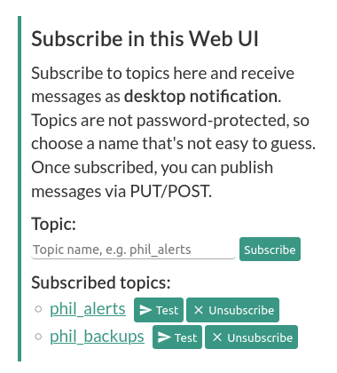

# Subscribe from the Web UI
You can use the Web UI to subscribe to topics as well. If you do, and you keep the website open, **notifications will
pop up as desktop notifications**. Simply type in the topic name and click the *Subscribe* button. The browser will 
keep a connection open and listen for incoming notifications.

<figure markdown>
  { width=300 }
  <figcaption>Subscribe via Web UI</figcaption>
</figure>

Once subscribed, you can [publish messages](../publish.md) via `curl` or from without any of your scripts.
