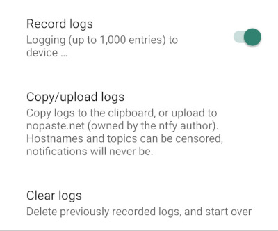
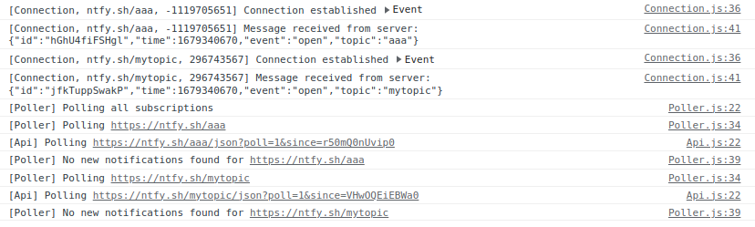

# Troubleshooting
This page lists a few suggestions of what to do when things don't work as expected. This is not a complete list. 
If this page does not help, feel free to drop by the [Discord](https://discord.gg/cT7ECsZj9w) or [Matrix](https://matrix.to/#/#ntfy:matrix.org)
and ask there. We're happy to help.

## ntfy server
If you host your own ntfy server, and you're having issues with any component, it is always helpful to enable debugging/tracing
in the server. You can find detailed instructions in the [Logging & Debugging](config.md#logging-debugging) section, but it ultimately
boils down to setting `log-level: debug` or `log-level: trace` in the `server.yml` file:

=== "server.yml (debug)"
    ``` yaml
    log-level: debug
    ```

=== "server.yml (trace)"
    ``` yaml
    log-level: trace
    ```

If you're using environment variables, set `NTFY_LOG_LEVEL=debug` (or `trace`) instead. You can also pass `--debug` or `--trace`
to the `ntfy serve` command, e.g. `ntfy serve --trace`. If you're using systemd (i.e. `systemctl`) to run ntfy, you can look at
the logs using `journalctl -u ntfy -f`. The logs will look something like this:

=== "Example logs (debug)"
    ```
    $ ntfy serve --debug
    2023/03/20 14:45:38 INFO Listening on :2586[http] :1025[smtp], ntfy 2.1.2, log level is DEBUG (tag=startup)
    2023/03/20 14:45:38 DEBUG Waiting until 2023-03-21 00:00:00 +0000 UTC to reset visitor stats (tag=resetter)
    2023/03/20 14:45:39 DEBUG Rate limiters reset for visitor (visitor_auth_limiter_limit=0.016666666666666666, visitor_auth_limiter_tokens=10, visitor_emails=0, visitor_emails_limit=12, visitor_emails_remaining=12, visitor_id=ip:127.0.0.1, visitor_ip=127.0.0.1, visitor_messages=0, visitor_messages_limit=500, visitor_messages_remaining=500, visitor_request_limiter_limit=0.2, visitor_request_limiter_tokens=60, visitor_seen=2023-03-20T14:45:39.7-04:00)
    2023/03/20 14:45:39 DEBUG HTTP request started (http_method=POST, http_path=/mytopic, tag=http, visitor_auth_limiter_limit=0.016666666666666666, visitor_auth_limiter_tokens=10, visitor_emails=0, visitor_emails_limit=12, visitor_emails_remaining=12, visitor_id=ip:127.0.0.1, visitor_ip=127.0.0.1, visitor_messages=0, visitor_messages_limit=500, visitor_messages_remaining=500, visitor_request_limiter_limit=0.2, visitor_request_limiter_tokens=60, visitor_seen=2023-03-20T14:45:39.7-04:00)
    2023/03/20 14:45:39 DEBUG Received message (http_method=POST, http_path=/mytopic, message_body_size=2, message_delayed=false, message_email=, message_event=message, message_firebase=true, message_id=EZu6i2WZjH0v, message_sender=127.0.0.1, message_time=1679337939, message_unifiedpush=false, tag=publish, topic=mytopic, topic_last_access=2023-03-20T14:45:38.319-04:00, topic_subscribers=0, visitor_auth_limiter_limit=0.016666666666666666, visitor_auth_limiter_tokens=10, visitor_emails=0, visitor_emails_limit=12, visitor_emails_remaining=12, visitor_id=ip:127.0.0.1, visitor_ip=127.0.0.1, visitor_messages=1, visitor_messages_limit=500, visitor_messages_remaining=499, visitor_request_limiter_limit=0.2, visitor_request_limiter_tokens=59.0002132248, visitor_seen=2023-03-20T14:45:39.7-04:00)
    2023/03/20 14:45:39 DEBUG Adding message to cache (http_method=POST, http_path=/mytopic, message_body_size=2, message_event=message, message_id=EZu6i2WZjH0v, message_sender=127.0.0.1, message_time=1679337939, tag=publish, topic=mytopic, visitor_auth_limiter_limit=0.016666666666666666, visitor_auth_limiter_tokens=10, visitor_emails=0, visitor_emails_limit=12, visitor_emails_remaining=12, visitor_id=ip:127.0.0.1, visitor_ip=127.0.0.1, visitor_messages=1, visitor_messages_limit=500, visitor_messages_remaining=499, visitor_request_limiter_limit=0.2, visitor_request_limiter_tokens=59.000259165, visitor_seen=2023-03-20T14:45:39.7-04:00)
    2023/03/20 14:45:39 DEBUG HTTP request finished (http_method=POST, http_path=/mytopic, tag=http, time_taken_ms=2, visitor_auth_limiter_limit=0.016666666666666666, visitor_auth_limiter_tokens=10, visitor_emails=0, visitor_emails_limit=12, visitor_emails_remaining=12, visitor_id=ip:127.0.0.1, visitor_ip=127.0.0.1, visitor_messages=1, visitor_messages_limit=500, visitor_messages_remaining=499, visitor_request_limiter_limit=0.2, visitor_request_limiter_tokens=59.0004147334, visitor_seen=2023-03-20T14:45:39.7-04:00)
    2023/03/20 14:45:39 DEBUG Wrote 1 message(s) in 8.285712ms (tag=message_cache)
    ...    
    ```

=== "Example logs (trace)"
    ```
    $ ntfy serve --trace
    2023/03/20 14:40:42 INFO Listening on :2586[http] :1025[smtp], ntfy 2.1.2, log level is TRACE (tag=startup)
    2023/03/20 14:40:42 DEBUG Waiting until 2023-03-21 00:00:00 +0000 UTC to reset visitor stats (tag=resetter)
    2023/03/20 14:40:59 DEBUG Rate limiters reset for visitor (visitor_auth_limiter_limit=0.016666666666666666, visitor_auth_limiter_tokens=10, visitor_emails=0, visitor_emails_limit=12, visitor_emails_remaining=12, visitor_id=ip:127.0.0.1, visitor_ip=127.0.0.1, visitor_messages=0, visitor_messages_limit=500, visitor_messages_remaining=500, visitor_request_limiter_limit=0.2, visitor_request_limiter_tokens=60, visitor_seen=2023-03-20T14:40:59.893-04:00)
    2023/03/20 14:40:59 TRACE HTTP request started (http_method=POST, http_path=/mytopic, http_request=POST /mytopic HTTP/1.1
    User-Agent: curl/7.81.0
    Accept: */*
    Content-Length: 2
    Content-Type: application/x-www-form-urlencoded
    
    hi, tag=http, visitor_auth_limiter_limit=0.016666666666666666, visitor_auth_limiter_tokens=10, visitor_emails=0, visitor_emails_limit=12, visitor_emails_remaining=12, visitor_id=ip:127.0.0.1, visitor_ip=127.0.0.1, visitor_messages=0, visitor_messages_limit=500, visitor_messages_remaining=500, visitor_request_limiter_limit=0.2, visitor_request_limiter_tokens=60, visitor_seen=2023-03-20T14:40:59.893-04:00)
    2023/03/20 14:40:59 TRACE Received message (http_method=POST, http_path=/mytopic, message_body={
      "id": "Khaup1RVclU3",
      "time": 1679337659,
      "expires": 1679380859,
      "event": "message",
      "topic": "mytopic",
      "message": "hi"
    }, message_body_size=2, message_delayed=false, message_email=, message_event=message, message_firebase=true, message_id=Khaup1RVclU3, message_sender=127.0.0.1, message_time=1679337659, message_unifiedpush=false, tag=publish, topic=mytopic, topic_last_access=2023-03-20T14:40:59.893-04:00, topic_subscribers=0, visitor_auth_limiter_limit=0.016666666666666666, visitor_auth_limiter_tokens=10, visitor_emails=0, visitor_emails_limit=12, visitor_emails_remaining=12, visitor_id=ip:127.0.0.1, visitor_ip=127.0.0.1, visitor_messages=1, visitor_messages_limit=500, visitor_messages_remaining=499, visitor_request_limiter_limit=0.2, visitor_request_limiter_tokens=59.0001785048, visitor_seen=2023-03-20T14:40:59.893-04:00)
    2023/03/20 14:40:59 DEBUG Adding message to cache (http_method=POST, http_path=/mytopic, message_body_size=2, message_event=message, message_id=Khaup1RVclU3, message_sender=127.0.0.1, message_time=1679337659, tag=publish, topic=mytopic, visitor_auth_limiter_limit=0.016666666666666666, visitor_auth_limiter_tokens=10, visitor_emails=0, visitor_emails_limit=12, visitor_emails_remaining=12, visitor_id=ip:127.0.0.1, visitor_ip=127.0.0.1, visitor_messages=1, visitor_messages_limit=500, visitor_messages_remaining=499, visitor_request_limiter_limit=0.2, visitor_request_limiter_tokens=59.0002044368, visitor_seen=2023-03-20T14:40:59.893-04:00)
    2023/03/20 14:40:59 DEBUG HTTP request finished (http_method=POST, http_path=/mytopic, tag=http, time_taken_ms=1, visitor_auth_limiter_limit=0.016666666666666666, visitor_auth_limiter_tokens=10, visitor_emails=0, visitor_emails_limit=12, visitor_emails_remaining=12, visitor_id=ip:127.0.0.1, visitor_ip=127.0.0.1, visitor_messages=1, visitor_messages_limit=500, visitor_messages_remaining=499, visitor_request_limiter_limit=0.2, visitor_request_limiter_tokens=59.000220502, visitor_seen=2023-03-20T14:40:59.893-04:00)
    2023/03/20 14:40:59 TRACE No stream or WebSocket subscribers, not forwarding (message_body_size=2, message_event=message, message_id=Khaup1RVclU3, message_sender=127.0.0.1, message_time=1679337659, tag=publish, topic=mytopic, visitor_auth_limiter_limit=0.016666666666666666, visitor_auth_limiter_tokens=10, visitor_emails=0, visitor_emails_limit=12, visitor_emails_remaining=12, visitor_id=ip:127.0.0.1, visitor_ip=127.0.0.1, visitor_messages=1, visitor_messages_limit=500, visitor_messages_remaining=499, visitor_request_limiter_limit=0.2, visitor_request_limiter_tokens=59.0002369212, visitor_seen=2023-03-20T14:40:59.893-04:00)
    2023/03/20 14:41:00 DEBUG Wrote 1 message(s) in 9.529196ms (tag=message_cache)
    ...
    ```

## Android app
On Android, you can turn on logging in the settings under **Settings → Record logs**. This will store up to 1,000 log
entries, which you can then copy or upload. 

<figure markdown>
  { width=400 }
  <figcaption>Recording logs on Android</figcaption>
</figure>

When you copy or upload the logs, you can censor them to make it easier to share them with others. ntfy will replace all
topics and hostnames with fruits. Here's an example:

```
This is a log of the ntfy Android app. The log shows up to 1,000 entries.
Server URLs (aside from ntfy.sh) and topics have been replaced with fruits 🍌🥝🍋🥥🥑🍊🍎🍑.

Device info:
--
ntfy: 1.16.0 (play)
OS: 4.19.157-perf+
Android: 13 (SDK 33)
...

Logs
--

1679339199507 2023-03-20 15:06:39.507 D NtfyMainActivity Battery: ignoring optimizations = true (we want this to be true); instant subscriptions = true; remind time reached = true; banner = false
1679339199507 2023-03-20 15:06:39.507 D NtfySubscriberMgr Enqueuing work to refresh subscriber service
1679339199589 2023-03-20 15:06:39.589 D NtfySubscriberMgr ServiceStartWorker: Starting foreground service with action START (work ID: a7eeeae9-9356-40df-afbd-236e5ed10a0b)
1679339199602 2023-03-20 15:06:39.602 D NtfySubscriberService onStartCommand executed with startId: 262
1679339199602 2023-03-20 15:06:39.602 D NtfySubscriberService using an intent with action START
1679339199629 2023-03-20 15:06:39.629 D NtfySubscriberService Refreshing subscriptions
1679339199629 2023-03-20 15:06:39.629 D NtfySubscriberService - Desired connections: [ConnectionId(baseUrl=https://ntfy.sh, topicsToSubscriptionIds={avocado=23801492, lemon=49013182, banana=1309176509201171073, peach=573300885184666424, pineapple=-5956897229801209316, durian=81453333, starfruit=30489279, fruit12=82532869}), ConnectionId(baseUrl=https://orange.example.com, topicsToSubscriptionIds={apple=4971265, dragonfruit=66809328})]
1679339199629 2023-03-20 15:06:39.629 D NtfySubscriberService - Active connections: [ConnectionId(baseUrl=https://orange.example.com, topicsToSubscriptionIds={apple=4971265, dragonfruit=66809328}), ConnectionId(baseUrl=https://ntfy.sh, topicsToSubscriptionIds={avocado=23801492, lemon=49013182, banana=1309176509201171073, peach=573300885184666424, pineapple=-5956897229801209316, durian=81453333, starfruit=30489279, fruit12=82532869})]
...
```

To get live logs, or to get more advanced access to an Android phone, you can use [adb](https://developer.android.com/studio/command-line/adb).
After you install and [enable adb debugging](https://developer.android.com/studio/command-line/adb#Enabling), you can
get detailed logs like so:

```
# Connect to phone (enable Wireless debugging first)
adb connect 192.168.1.137:39539

# Print all logs; you may have to pass the -s option
adb logcat
adb -s 192.168.1.137:39539 logcat

# Only list ntfy logs
adb logcat --pid=$(adb shell pidof -s io.heckel.ntfy)
adb -s 192.168.1.137:39539 logcat --pid=$(adb -s 192.168.1.137:39539 shell pidof -s io.heckel.ntfy)
```

## Web app
The web app logs everything to the **developer console**, which you can open by **pressing the F12 key** on your 
keyboard.

<figure markdown>
  
  <figcaption>Web app logs in the developer console</figcaption>
</figure>

## iOS app
Sorry, there is no way to debug or get the logs from the iOS app (yet), outside of running the app in Xcode.
